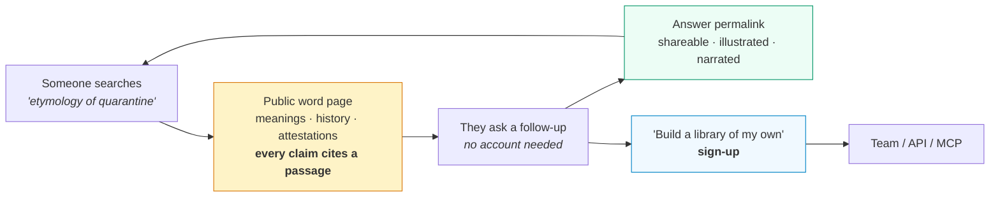

# Plan: Subjects — any thing can be a library, and people can actually reach it

**Status:** PLAN — not started
**Phase:** PLAN
**Builds on:** `.claude/plans/advisors.md` (personas, panels, retrieval-then-prompt), `.claude/plans/multitenant-postgres-pipeline.md` (tenancy, ACLs, queue, Postgres index)
**Reads with:** `docs/comparison/README.md` — this plan is the answer to that document's "What would change this page"

## Requirement

Two things, and they turn out to be one thing.

1. **Make people use it.** Today the product cannot be experienced without an account, a Gemini key, a Postgres, a worker process, and the patience to wait while a library builds. Nothing about that survives contact with a stranger.
2. **Any subject is a library.** Not only a scholar — a book, a word, a concept, an era. Openable with voice, video, images and text; a word carrying its meanings, its history and its first attestations; a book carrying its text, its editions and the criticism of it.

They are one thing because the second is what makes the first possible. A scholar library is worth building only to someone who already has a scholar in mind. **A word has a million people a day who already want it** — and every one of them arrives via a query we can answer from public-domain sources, with citations, in a way that no dictionary site currently does.

---

## What already exists

More than the ambition suggests. The engine is subject-agnostic already; only the entry points are person-shaped.

| Piece | Status | Reusable for books and words? |
| :-- | :-- | :-- |
| `Profile` with nullable `scholar` | `types.ts` | Yes — the object is already "a library", not "a person" |
| Seven `SourceKind`s normalised to `extractedText` | `server/sources.ts` | Yes — a Gutenberg text is a `document`; a Wiktionary page is `web` |
| Chunk → embed → `chunks` table, ACL-scoped hybrid retrieval | `server/indexer.ts`, `server/search.ts` | Yes, unchanged |
| Retrieval-then-prompt with exact citations, no tool attached | `server/advisor.ts` | Yes — the strongest asset in the repo |
| **Structural abstention** — no relevant passages, no model call | `askAdvisor` | Yes, and it is the whole trust story |
| Persona: register and stance, never facts | `0007_advisors.sql` | Yes — a book's "voice" is its author's register |
| Queue, retries, dead-letter, heartbeat reaping | `server/jobs.ts` | Yes — ingesting Gutenberg is the same job shape |
| Corpus de-duplication across owners | `server/corpus.ts` | Yes, and far more valuable: 60k public-domain books ingested **once** for everyone |
| TTS (headerless PCM → RIFF), illustration (JPEG) | `server/gemini.ts`, `server/export.ts` | Yes — narration and imagery already ship |
| Video and audio in, transcribed once at add time | `server/sources.ts` | Yes — "interact with video" is largely done |
| Crawlers with scheduling | `server/crawler.ts` | Yes — "word of the day" is a scheduled crawl |
| API keys, MCP server over the same router | `server/apiKeys.ts`, `mcp/server.mjs` | Yes — distribution channel, see Phase 9 |

**What does not exist, and gates everything:** a way for a stranger to see an answer without signing in; anything to see *before* they build a library; any measured statement that the answers are good; and any reason to come back tomorrow.

---

## The insight this plan rests on

**The abstention guarantee is worth nothing if nobody ever triggers it, and it is worth everything on a public page.**

A dictionary or bookstore built on a model *will* invent an etymology. Ours structurally cannot: no retrieved passage, no model call. That is a claim we can put on a public page next to a competitor's confident fabrication — and it is checkable, because every answer carries the passage.

So the adoption strategy is not "market the tool." It is: **publish millions of pages that are visibly, checkably right, each of which is a working demo of the product**, and let people who want their own library sign up from there.



That loop — search → public page → ask → share → search — is the only growth mechanism in this plan that does not depend on someone else's attention. Everything else is a wedge into one audience.

---

## Decisions

### D1 — A profile becomes a **subject**, by adding a kind, not by adding a table

`profiles` gains `subject_kind` (`scholar | book | word | topic | collection`) and `subject_key`. `scholar_name`, `affiliation`, `topics` and `scholar_keys` stay exactly as they are and remain the `scholar` case's fields.

Rationale is D1 of the advisors plan, repeated because it keeps paying: a new table would need ACLs, sharing, the crawler, the queue, corpus de-dup, the index, export and chat rebuilt around it. A column inherits all of them on the day it is added.

The cost: `profiles` now means five things. Acceptable — they differ in *how sources are acquired*, and in nothing else downstream.

### D2 — Only public-domain and open-access sources, and this is a feature

Books come from **Project Gutenberg** (~75k public-domain full texts), **Open Library / Internet Archive** (metadata, covers, editions), **Wikisource**. Words come from **Wiktionary** (CC-BY-SA), **Wikidata** (CC0), **Google Books Ngrams** (frequency over time), **Chronicling America** (public-domain newspapers, for first-attestation evidence).

Not Etymonline (proprietary, no API, scraping it is theft), not OED (licensed), not in-copyright books.

This is the same constraint `docs/comparison/README.md` calls a structural weakness against Elicit — and against a *dictionary* it inverts into an advantage: the corpus of word history and classic literature **is** public domain. We are not fighting for licences here; we are the first to index the free thing properly.

### D3 — Public reading requires no account, and public answers are cached, not regenerated

A `visibility` of `public` plus a `public_slug` makes a subject readable by an anonymous request. Every question asked on a public subject is normalised and stored in an `answers` table with its citations. A repeat question is served from Postgres with **zero model calls**.

Three consequences, all load-bearing:
- **Cost is bounded by distinct questions, not by traffic.** Without this, one Hacker News front page is a four-figure Gemini bill.
- **Cached answers are the SEO surface.** Each is a real page with real citations.
- **They are the evaluation corpus.** Phase 8 samples them.

The ACL predicate is not bypassed. `authz.visibilityPredicate` gains a `public` branch and an anonymous caller is a real identity with no org — one predicate still, as `CLAUDE.md` requires.

### D4 — A word page is a *composed* page, not a chat log

Chat is a poor first impression for a stranger who typed one word. A word subject renders a fixed composition, each block grounded and each block already producible by existing machinery:

| Block | Grounded in | Built with |
| :-- | :-- | :-- |
| Senses, ordered by currency | Wiktionary sense list | Structuring pass, no tools |
| Etymology chain, as a diagram | Wiktionary + Wikidata | Structuring pass → mermaid/SVG |
| Timeline of first uses | Chronicling America hits, Gutenberg concordance | Retrieval, with the passage shown |
| Frequency over 200 years | Ngrams | Static chart, no model |
| "Heard in the wild" | Sentences from indexed books | Pure retrieval, zero generation |
| Illustration | — | `gemini-3.1-flash-image` |
| Read aloud | — | existing TTS path |
| Ask anything | The above, indexed | `askAdvisor`, abstention included |

The same composition idea for books: blurb, editions, characters, themes, notable passages, "ask the book", read-aloud, cover art.

### D5 — Voice ships in three stages and only the first is unconditional

- **V1 — narrated answers.** Already possible: `/api/tts` exists, the WAV wrapper exists. A speaker button on any answer.
- **V2 — voice in, text and audio out.** Uses the existing upload-and-transcribe path. No new dependency, no latency budget.
- **V3 — live conversation** (Gemini Live API). **Spike first** (`scripts/spike-live.mjs`), per the SDLC's rule that a plan resting on unverified API behaviour must prove it. The unknowns are real: whether retrieval can be injected mid-session, whether citations survive, cost per minute, and whether abstention can hold in a live session — if it cannot, V3 does not ship, because a fluent voice inventing an etymology destroys the only thing that makes this product trustworthy.

`CLAUDE.md` already records that TTS is unreachable via the Interactions API; assume nothing about Live.

### D6 — Video means *video in*, and short *video out* is generated, never streamed live

Video in already works. Video out is a rendered composition — illustration frames plus narration plus captions, assembled with ffmpeg into a 30-second shareable clip for a word or book. It is a share asset, not an interaction mode. Deliberately last.

### D7 — Ship an evaluation before shipping the audience

`docs/comparison/README.md` is blunt that the project has no accuracy numbers, and the moment the pages are public that gap becomes the entire objection. A held-out question set with known answers, run against real subjects, reported as three numbers: **grounded-correct**, **abstained**, **wrong**. Wrong is the only failure. A high abstention rate is a *product* problem (thin libraries) and it must be visible as one.

### D8 — Cold start is solved by seeding, not by asking users to build

A new visitor must never see an empty state. We pre-build and publish a launch set: **1,000 words** (the ones people actually look up), **250 books**, **100 scholars**. Cost is one-time, runs on the queue, and de-duplicates through `server/corpus.ts`.

### D9 — What we will not build

Stated so it is not re-litigated: no in-copyright content, no citation graph (ResearchRabbit does it better), no systematic-review tooling (Elicit owns it), no connectors/SSO/enterprise search (Onyx owns it), no clone-yourself product (Delphi owns it), no mobile app before the web loop works, no user-generated public shelves until moderation exists (Phase 3 publishes only what we curate).

---

## Data model

```sql
-- 0009_subjects.sql
CREATE TYPE subject_kind AS ENUM ('scholar','book','word','topic','collection');

ALTER TABLE profiles
  ADD COLUMN subject_kind subject_kind NOT NULL DEFAULT 'scholar',
  -- Canonical identity for de-duplication: 'word:quarantine',
  -- 'book:gutenberg:1342', 'scholar:manindra-agrawal'. Extends the idea in
  -- server/corpus.ts scholarKey() to every kind.
  ADD COLUMN subject_key  text,
  -- Structured, kind-specific facets rendered by the composed page (D4).
  -- Never free-form model output: each field is written by a named producer.
  ADD COLUMN facets       jsonb NOT NULL DEFAULT '{}'::jsonb;

CREATE UNIQUE INDEX profiles_subject_key ON profiles (subject_key)
  WHERE subject_key IS NOT NULL AND visibility = 'public';

-- 0010_public.sql
ALTER TYPE visibility ADD VALUE 'public';

ALTER TABLE profiles
  ADD COLUMN public_slug text UNIQUE,
  ADD COLUMN featured    boolean NOT NULL DEFAULT false,
  ADD COLUMN published_at timestamptz;

-- Cached public answers (D3). The unique key is the normalised question, so
-- repeat traffic costs nothing and every row is a page.
CREATE TABLE answers (
  id             uuid PRIMARY KEY DEFAULT gen_random_uuid(),
  profile_id     text NOT NULL REFERENCES profiles (id) ON DELETE CASCADE,
  question       text NOT NULL,
  question_norm  text NOT NULL,
  answer         text,
  -- Exact: the chunks we retrieved, as in consultation_answers.
  citations      jsonb NOT NULL DEFAULT '[]'::jsonb,
  -- True when retrieval found nothing and no model call was made. Counted,
  -- because the abstention rate is a headline metric, not an error rate.
  abstained      boolean NOT NULL DEFAULT false,
  illustration_key text,
  audio_key      text,
  asked_count    integer NOT NULL DEFAULT 1,
  created_at     timestamptz NOT NULL DEFAULT now()
);
CREATE UNIQUE INDEX answers_question ON answers (profile_id, question_norm);
CREATE INDEX answers_popular ON answers (profile_id, asked_count DESC);

-- Curated shelves — the storefront (D8).
CREATE TABLE shelves (
  id          text PRIMARY KEY,
  title       text NOT NULL,
  blurb       text,
  emoji       text NOT NULL DEFAULT '📚',
  ordinal     integer NOT NULL DEFAULT 0,
  created_at  timestamptz NOT NULL DEFAULT now()
);
CREATE TABLE shelf_items (
  shelf_id   text NOT NULL REFERENCES shelves (id) ON DELETE CASCADE,
  profile_id text NOT NULL REFERENCES profiles (id) ON DELETE CASCADE,
  ordinal    integer NOT NULL DEFAULT 0,
  PRIMARY KEY (shelf_id, profile_id)
);

-- 0011_feedback.sql — feeds D7's evaluation and nothing else.
CREATE TABLE answer_feedback (
  id         uuid PRIMARY KEY DEFAULT gen_random_uuid(),
  answer_id  uuid NOT NULL REFERENCES answers (id) ON DELETE CASCADE,
  verdict    text NOT NULL CHECK (verdict IN ('helpful','wrong','unsupported')),
  note       text,
  created_at timestamptz NOT NULL DEFAULT now()
);
```

**Migration note.** `ALTER TYPE ... ADD VALUE` cannot run inside a transaction block in older Postgres and cannot be used in the same transaction that references the new value. Keep `0010` split or use a text column with a check constraint — decide during IMPLEMENT, verify against Postgres 17 before writing dependent code. And per `CLAUDE.md`: **`gcloud run jobs deploy scholarmind-migrate` must be updated**, or the service starts against a schema it does not have.

---

## Implementation

### Phase 0 — Prerequisites (blocking)

- [ ] **Measure the embedding dimension.** Still outstanding from the advisors plan, still blocking: `GEMINI_API_KEY=… npm run spike:postgres`, read check G2, `EMBEDDING_DIM=<n> npm run db:migrate`. Word and book libraries are *worse* than scholar libraries under keyword-only retrieval — "where does quarantine come from" shares almost no lexemes with a passage about forty days in Venice.
- [ ] `scripts/spike-sources.mjs` — prove the four new source APIs: Gutenberg mirror fetch and licence header stripping, Open Library edition lookup, Wiktionary sense extraction, Chronicling America search. Rate limits and terms recorded in the script's header.
- [ ] `scripts/spike-live.mjs` — Gemini Live: can retrieved passages be injected per turn, do we get text back to cite, what does a minute cost. **Gates D5-V3 only.**

### Phase 1 — Subjects

- [ ] `0009_subjects.sql`; regenerate types in `types.ts`: `SubjectKind`, `Subject`, `facets` typed per kind.
- [ ] `server/subjects.ts` — new. `subjectKey()`, `facetsFor(kind)`, and a registry mapping a kind to its acquisition job. The registry is the extension point; adding a kind must not touch the router.
- [ ] `server/repository.ts` — `createProfile`/`listProfiles` accept and filter by `subject_kind`; `findByScholarKeys` generalises to `findBySubjectKey` (keep the old name as a thin wrapper so `crawler.ts`'s duplicate check is untouched).
- [ ] `server/router.ts` — `POST /profiles` takes `{kind, subject}`; `GET /profiles?kind=word`.
- [ ] Backfill: every existing profile is `subject_kind='scholar'`, `subject_key=scholarKey(scholar_name)`.
- [ ] **Nothing in `search.ts`, `indexer.ts`, `advisor.ts`, `authz.ts` changes.** If a diff appears in those files during this phase, the abstraction is wrong — stop and re-plan.

### Phase 2 — Acquisition adapters

New directory `server/subjects/`, one file per source, each exporting `acquire(subject) → Paper[]` in the existing shape so `ingest.ts` is unchanged.

- [ ] `gutenberg.ts` — search by title/author, fetch the plain-text mirror, strip licence headers, split into chapters as separate sources so citations name a chapter rather than a 400-page book.
- [ ] `openlibrary.ts` — editions, first-publication year, cover → blob store, subjects.
- [ ] `wiktionary.ts` — senses, etymology, pronunciation, quotations. Parse the structured wikitext; do **not** ask a model to invent structure the page already has.
- [ ] `wikidata.ts` — identity resolution: disambiguate "Mercury", link a book to its author subject.
- [ ] `ngrams.ts` — frequency series, cached in `facets`. No model, no index.
- [ ] `chronicling.ts` — dated attestations; each hit is an indexed source with its date, so "first recorded use" is a retrieved passage, never a claim.
- [ ] Queue jobs `subject.acquire.{book,word}` in `server/jobs.ts`, retry policy unchanged.
- [ ] `server/corpus.ts` — extend `canonicalKey` so a Gutenberg text downloaded once serves every subject and every owner.

### Phase 3 — Public subjects, anonymous reading (the adoption core)

- [ ] `0010_public.sql`.
- [ ] `server/authz.ts` — a `public` branch in `visibilityPredicate`. **One predicate.** Anonymous callers get an identity with no org and no team; per `CLAUDE.md` the collapsed form must still *reference* its parameter.
- [ ] `server/identity.ts` — an anonymous principal, read-only, rate-limited by IP.
- [ ] `GET /public/:slug`, `GET /public/:slug/answers`, `POST /public/:slug/ask`.
- [ ] Rate limits and an abuse budget per IP; a global daily cap on *new* (uncached) public questions, so a scraper cannot spend the month's tokens in an afternoon.
- [ ] `components/SubjectPage.tsx` — the composed page of D4, server-rendered enough to be indexable.
- [ ] `components/Shelf.tsx` — the storefront: shelves, covers, a search box that answers from stored identities with no model call (the existing "Find a library" behaviour).
- [ ] Seed script `scripts/seed-subjects.mjs` for D8's launch set, driven by a checked-in word/book list, resumable, running through the normal queue.

### Phase 4 — The share loop

- [ ] Answer permalinks: `GET /a/:answerId` — question, answer, citations, illustration, audio.
- [ ] OG image generation from the existing illustration path; a shared link must look like something.
- [ ] Copy-as-text and copy-as-citation buttons — every answer already has real bibliographic data via `citations.ts`.
- [ ] "Ask this of your own library" call-to-action, carrying the question through sign-up so the first thing a new account does is get an answer.
- [ ] `answers.asked_count` powers a "most asked" block per subject and a global trending shelf.

### Phase 5 — Multimodal composition

- [ ] Narration on any answer (V1) — wire the existing `/api/tts` into `SubjectPage`; cache to `answers.audio_key` so a popular answer is synthesised once.
- [ ] Illustration on any answer, same caching.
- [ ] Etymology chain and timeline as **SVG/mermaid built from `facets`**, not from prose. A diagram derived from structured data cannot hallucinate.
- [ ] Frequency chart from `ngrams`.
- [ ] "Heard in the wild" — pure retrieval over indexed books, zero generation. Cheapest and most convincing block on the page.

### Phase 6 — Voice

- [ ] V2 — voice in: record in-browser, existing upload/transcribe path, answer spoken back. No new dependency.
- [ ] V3 — live conversation, **only if `spike-live.mjs` shows retrieval can be injected per turn and citations survive.** If it cannot hold abstention, ship V2 and say why in the docs.
- [ ] V3 guardrail: a live turn with no retrieved passages must say so out loud. Same rule, spoken.

### Phase 7 — Audience wedges

Each is small, each targets one of the four audiences, and each is independently shippable.

| Audience | Build | Why it converts |
| :-- | :-- | :-- |
| Researchers | **Zotero / BibTeX / RIS import** (`POST /profiles/:id/import/library`) | Turns the incumbent workflow into an input. `docs/comparison` names this the cheapest strategic fix on the page |
| Researchers | arXiv / ORCID subject kinds, and a "new paper by this scholar" digest via the existing crawler schedule | A reason to return that requires no user action |
| Learners | **Word of the day / book of the day**, published as a public page and an email | Recurring, zero-effort, SEO-compounding |
| Teachers | **Course mode**: a subject shared by link to a class, with the existing quiz/flashcards/slides as assigned work and a simple completion view | Quizzes and flashcards already exist and are currently under-used |
| Teachers | Read-only class links that need no student accounts | Removes the institutional blocker entirely |
| Teams | Seat-based sharing, usage view, key management UI, and the MCP server listed in client directories | The only revenue path here; everything above feeds it |

### Phase 8 — Trust, measured

- [ ] `tests/eval/` — a checked-in question set per subject kind, each with a known answer and a known-uncoverable control question.
- [ ] `scripts/eval.mjs` — runs it against a live instance, reports **grounded-correct / abstained / wrong**.
- [ ] Publish the numbers in `docs/comparison/README.md` and on a public `/trust` page, updated per release. This closes the largest gap that document names.
- [ ] `answer_feedback` wired to a thumbs control; "unsupported" reports are triaged as bugs, not opinions.
- [ ] A per-subject `abstentionRate`, surfaced to the owner as *"this library is thin"* — the existing `deepCount` idea, made actionable.

### Phase 9 — Distribution

- [ ] Static rendering / prerender for public subject and answer pages; sitemap; structured data (`DefinedTerm`, `Book`, `QAPage`).
- [ ] An embeddable widget: `<script>` + iframe for one subject, so a blog about a book can carry an askable version of it.
- [ ] MCP server published to client directories; "ask a scholar" and "look up a word" as tools. Distribution through someone else's client is the cheapest channel available.
- [ ] Public API docs and a free key tier.

---

## Tests

Following the existing rule — pure or easily faked logic, in the places a regression is *silent*.

| New suite | Guards against |
| :-- | :-- |
| `subjects.test.ts` | `subjectKey()` collisions across kinds — a word and a book de-duplicating into each other |
| `publicAuthz.test.ts` | **the one that matters**: an anonymous caller reaching a non-public profile; the `public` branch widening org visibility; the collapsed predicate dropping its parameter |
| `answers.test.ts` | question normalisation too loose (wrong cached answer served) or too strict (cache never hits, cost model breaks) |
| `wiktionary.test.ts` | wikitext parsing drift silently producing empty senses |
| `gutenberg.test.ts` | licence-header stripping leaving boilerplate in the index, or eating chapter one |
| `ratelimit.test.ts` | the anonymous budget failing open |
| `eval` (script, not CI) | answer quality regressions between releases |

Integration tests for the public path go in `tests/integration/` behind `TEST_DATABASE_URL`, as usual.

## Docs

- `docs/general/features.md` — subjects, public pages, voice, course mode.
- `docs/architecture/README.md` — the `public` visibility branch and why the answer cache is architecture rather than an optimisation.
- `docs/comparison/README.md` — update after Phase 8 with real numbers; re-check competitor claims.
- `docs/api/README.md` — public endpoints, anonymous limits, embed snippet.
- `CLAUDE.md` — two new load-bearing constraints once verified: the `ALTER TYPE` transaction restriction, and whatever the Live spike finds.
- `README.md` — lead with a public example URL. Someone must be able to *see* it working before installing anything.

---

## Sequencing

Phases 0–4 are the product. Everything after is leverage on it.

```mermaid
gantt
    title Order, not dates
    dateFormat X
    axisFormat %s
    section Foundation
    P0 spikes + embedding dim   :0, 1
    P1 subjects                 :1, 2
    P2 adapters                 :2, 4
    section Adoption
    P3 public + shelves         :4, 6
    P4 share loop               :6, 7
    P5 multimodal               :7, 8
    section Leverage
    P6 voice                    :8, 9
    P7 wedges                   :7, 10
    P8 evaluation               :6, 10
    P9 distribution             :9, 11
```



**If only three things get built:** Phase 0 (the index is useless without it), Phase 3 (nobody can see the product without it), Phase 8 (nobody should trust it without it).

## Success metrics

Chosen so they cannot be satisfied by traffic alone.

| Metric | Why this one |
| :-- | :-- |
| **Time to first grounded answer, anonymous** | Target under 10 seconds. Today it is effectively infinite |
| **Wrong-answer rate** from Phase 8 | The only number that can kill the product. Abstentions are not failures |
| **Abstention rate on public pages** | If high, libraries are thin — a build problem, not a model problem |
| **Cache hit rate on public questions** | Determines whether the cost model survives success |
| **Share rate per answer** | Whether the growth loop is a loop or a funnel |
| **Public page → account conversion** | Whether the free surface feeds the product or replaces it |
| **Week-4 retention of accounts** | Whether anyone builds a *second* library |

---

## Risks

| Risk | Mitigation |
| :-- | :-- |
| **Cost blows up on a traffic spike** | D3's cache, a global daily cap on uncached questions, IP limits. Model this *before* launch, not after |
| **Public pages read as thin AI content** and are penalised or resented | Every block is either retrieved text or structured data from a named source. The pages are mostly *quotation*, which is exactly what a dictionary should be |
| **A wrong etymology on a public page** | The abstention guarantee, plus feedback triage, plus published eval numbers. One viral wrong answer costs more than a month of traffic is worth |
| **Licence and attribution** | Wiktionary is CC-BY-SA — attribution and share-alike are obligations, and a generated summary of a CC-BY-SA page is a derivative. Get this right in Phase 2 or not at all |
| **`ALTER TYPE ADD VALUE` transaction restriction** | Verify against Postgres 17 in Phase 0; the fallback is a text column with a check constraint |
| **Gemini lock-in** | Public traffic makes this an existential cost dependency. Tool-free calls already read `plainModel()`; Phase 8's eval makes swapping the plain model a measurable decision instead of a leap |
| **Scope: four audiences at once** | Phases 0–5 serve all four identically. Only Phase 7 forks, and each wedge is small and independently droppable |
| **Moderation of public content** | Phase 3 publishes only curated seeds. User-published shelves stay out until there is a moderation path (D9) |
| **The person-shaped brand** | "ScholarMind" fits scholars, not words and books. A naming decision is needed by Phase 3, and it is a product decision, not an engineering one |

## Open questions

1. **Does the composed word page beat a chat box for a first-time visitor?** Assumed yes (D4). Cheap to test with two public pages before Phase 3 finishes.
2. **How thin is a word library really?** A Wiktionary entry plus a handful of attestations may abstain on most natural questions. Measure on 20 seeded words before committing to 1,000.
3. **Domain and naming** — see the risk above.
4. **Does live voice hold abstention?** Answered by the spike, not by discussion.
5. **Is there a paid consumer tier at all,** or is the public surface purely a funnel to teams? Affects nothing before Phase 7.

---

## Implementation log

*(empty — PLAN phase)*
