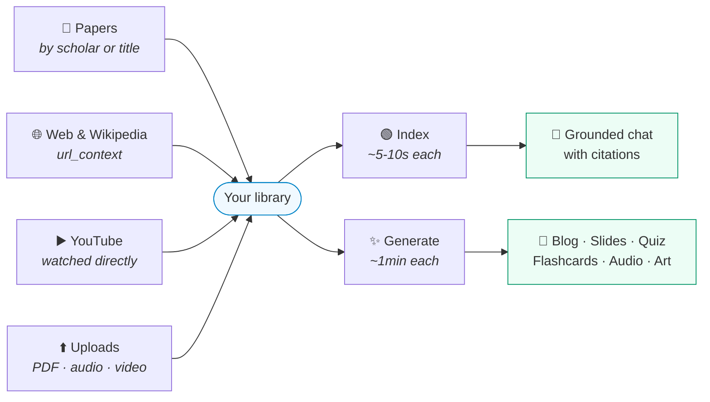
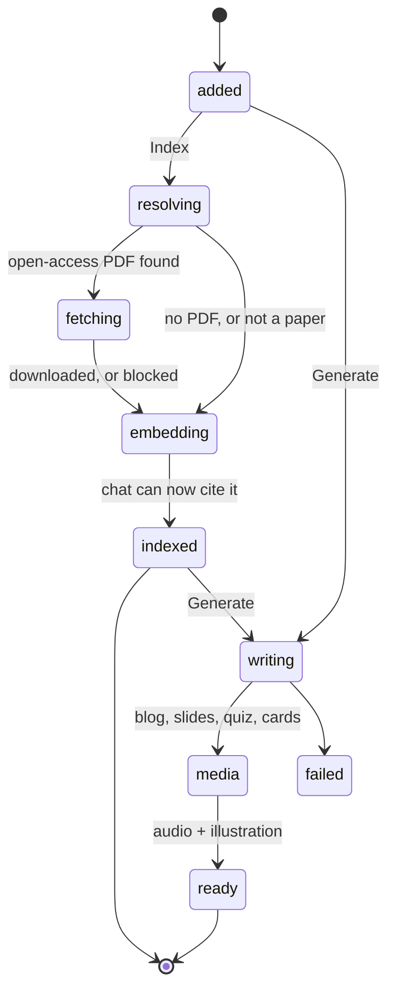
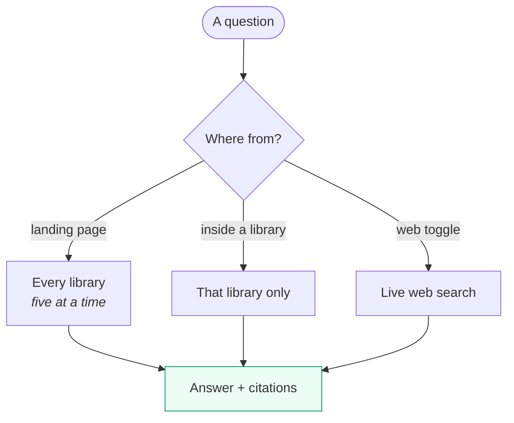
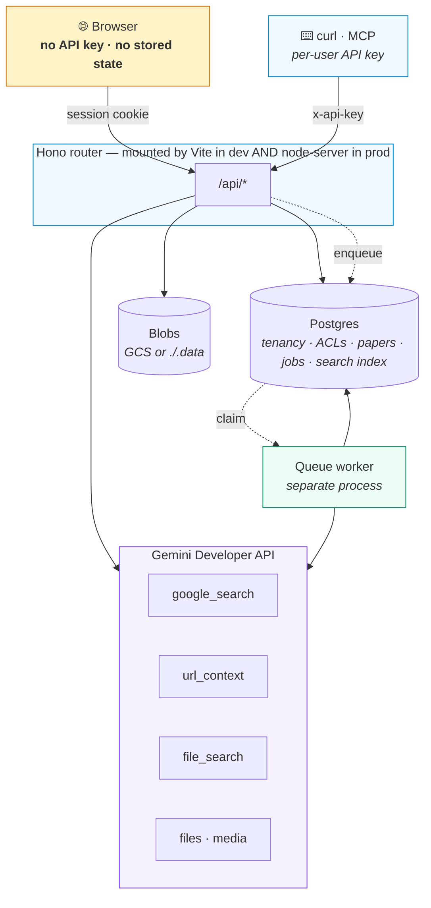
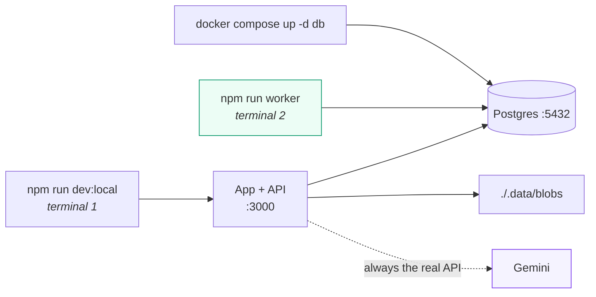

# 🎓 ScholarMind

Collect what you are trying to understand — papers, articles, Wikipedia,
YouTube, recordings, your own documents — and ScholarMind reads all of it, makes
it searchable, and answers questions with citations back to the source.

It will also write the blog post, the slides, the quiz, the flashcards, the
narration and the cover art, when you want to *learn* the material rather than
just search it. Every Gemini call is server-side; the browser holds no key and
no state.

---

## What goes in



Everything is normalised to text as it arrives — a video is watched once, a
recording transcribed once — so one pipeline handles all of it from there on.

**Index** and **Generate** are separate buttons because they cost differently.
Indexing makes a source searchable in seconds; generating a study module takes
about a minute. Most questions only need the first.

---

## The library



Every step can fail without stopping the rest. No PDF falls back to URL context,
then to search grounding; a source that cannot be fetched is still indexed from
what is known about it. One bad source never aborts a run.

**Papers are only fetched once.** A shared corpus caches the resolved URL and
the PDF bytes across every library, so the second library to index a paper skips
resolution and download — measured at 10.6s cold against 5.2s reused, and it
still works when the publisher has since started blocking automated access.

---

## Asking



The landing page asks across everything you have collected. Open a library and
the same question is scoped to it alone.

Cross-library answers report what they searched, because they have to: **File
Search accepts at most five stores per call.** With more libraries than that,
the five most recently touched are searched and the answer says how many were
left out. A partial answer presented as a complete one would be worse than the
limit.

---

## Citations

Every source cites in **BibTeX, APA, MLA, Chicago, Harvard and RIS**, one at a
time or as a whole bibliography.

Bibliographic detail comes from Crossref or not at all. A hallucinated volume
number reads as authoritative, gets pasted into somebody's bibliography, and is
wrong — so fields are omitted rather than guessed, and the dialog says which of
the two happened.

---

## Architecture



**One router implementation** serves development and production, so nothing
works locally but breaks when deployed.

**Work outlives the request.** Crawling a scholar and indexing their papers takes
minutes, so requests enqueue and return a run id; the worker does the work and
the client polls. Closing the tab no longer cancels anything.

**Every resource belongs to an org, a team and an owner,** with a visibility and
optional per-person grants. The authorization predicate is part of the same query
as the data it guards, which is also why the search index is in Postgres rather
than in Gemini's File Search — see [Constraints](#constraints-worth-knowing).

→ [Architecture in depth](docs/architecture/README.md)

---

## Quick start

**Needs** Node 22+, Docker, and a [Gemini API key](https://aistudio.google.com/apikey).

```bash
npm install
cp .env.example .env      # add GEMINI_API_KEY
docker compose up -d db   # Postgres 17 + pgvector on :5432
npm run db:migrate
```



Verify with `curl localhost:3000/api/healthz`:

```json
{"ok": true, "geminiKey": "configured", "database": "reachable", "acl": "disabled", "blobs": "filesystem"}
```

> **Run the worker.** Without it, indexing and enrichment queue up and nothing
> ever happens — the UI will sit at "queued" indefinitely.

> **Semantic search needs one measured number.** `gemini-embedding-2`'s output
> dimension is not in this repository. Until you supply it, search is
> keyword-only:
> ```bash
> GEMINI_API_KEY=… npm run spike:postgres    # read check G2
> EMBEDDING_DIM=<n> npm run db:migrate
> ```

> **No File Search emulator exists.** Chat grounding always calls the real API,
> even locally. `FILE_SEARCH_STORE_PREFIX=dev-` keeps local stores identifiable.

→ [Development guide](docs/development/README.md)

---

## API and MCP

The browser, `curl` and MCP clients all hit the same router.

```bash
export SM=http://localhost:8080 KEY=your-key

curl -s "$SM/api/discover?q=Hinton" -H "x-api-key: $KEY"

curl -s $SM/api/profiles/$ID/sources -H "x-api-key: $KEY" \
  -H 'content-type: application/json' \
  -d '{"url":"https://www.youtube.com/watch?v=aircAruvnKk"}'

curl -sN $SM/api/chat -H "x-api-key: $KEY" -H 'content-type: application/json' \
  -d '{"message":"What do my libraries say about attention?"}'
```

```bash
claude mcp add scholarmind -- node /absolute/path/to/mcp/server.mjs
```

Thirteen tools: find and build libraries, add sources, index, generate, ask,
cite, export. A wrong API key is refused in **every** environment, including
local development — otherwise a misconfigured integration works on a laptop and
fails only once deployed.

→ [API & MCP reference, with examples](docs/api/README.md)

---

## Models

| Purpose | Model |
| :--- | :--- |
| Search, reasoning, generation, chat, media understanding | `gemini-3.8-flash` |
| Cover illustrations | `gemini-3.1-flash-image` |
| Speech | `gemini-3.1-flash-tts-preview` |
| Retrieval embeddings | `gemini-embedding-2` |

Text and media understanding use the **Interactions API**; speech and images
stay on `generateContent`.

---

## Constraints worth knowing

All four were found by testing the live API, and all four shape the design.
The third is the reason the architecture looks the way it does.

**Grounding tools are mutually exclusive.** File Search combines with neither
Google Search nor URL Context. So work is staged, and chat exposes a visible
toggle rather than guessing.

**File Search corrupts structured JSON.** Its citation-insertion pass rewrites
the `[` that opens a JSON array. Grounded structured generation therefore runs
in two calls: grounded prose, then structuring with no tools.

**Retrieval cannot be scoped below a store, so the search index moved to
Postgres.** `metadataFilter` only matches the API's own recognised keys — an
app-defined key silently matches nothing — and a call accepts at most five
stores. Under sharing, the set of libraries a person can see differs per person
and routinely exceeds five, so a store boundary cannot express it. The index now
lives in Postgres, where the authorization predicate is a clause in the same
query as the retrieval. File Search is kept for single-profile chat grounding,
where the cap is irrelevant.

**The Interactions API does not take `parts`.** Media goes in as typed content
blocks: `{type:'video', uri}` with a YouTube link works directly, no download.

→ [The full reasoning](docs/architecture/README.md)

---

## Scripts

| Command | Purpose |
| :--- | :--- |
| `npm run dev:local` | App + API against the local database |
| `npm run worker` | Queue worker — nothing is processed without it |
| `npm run db:migrate` | Apply migrations (`db:reset` drops and rebuilds) |
| `npm run spike:postgres` | Check pgvector and measure the embedding dimension |
| `npm test` | Vitest — pure logic, no network |
| `npm run build` | Production client build |
| `npm start` | Production server |
| `npm run mcp` | MCP server over stdio |
| `npm run typecheck` | `tsc --noEmit` |
| `node scripts/reconcile-stores.mjs` | Find File Search stores nothing references |

## Layout

```
server/       router · repository · blobStore · gemini · ingest
              sources · corpus · citations · export
components/   React UI
mcp/          MCP server (a client of the HTTP API)
services/     api.ts — the browser's only server interface
tests/        vitest, no network
docs/         architecture · api · development · deployment · features · sdlc
scripts/      live API verification spikes, housekeeping
```

## Docs

| | |
| :--- | :--- |
| [Architecture](docs/architecture/README.md) | Design and the reasoning behind it |
| [API & MCP](docs/api/README.md) | Endpoints, tools, worked examples |
| [Features](docs/general/features.md) | User guide |
| [Development](docs/development/README.md) | Local setup, conventions, debugging |
| [Deployment](docs/deployment/README.md) | GCP provisioning end to end |
| [SDLC](docs/sdlc/README.md) | How this project is planned and built |

## License

[MIT](LICENSE). Use it, modify it, ship it — commercially or otherwise. The only
condition is that the copyright notice travels with the code.

Note that the third-party services ScholarMind calls carry their own terms:
the [Gemini API](https://ai.google.dev/gemini-api/terms),
[Unpaywall](https://unpaywall.org/legal), and
[Crossref](https://www.crossref.org/documentation/retrieve-metadata/rest-api/).
Only open-access full texts are ever retrieved.
