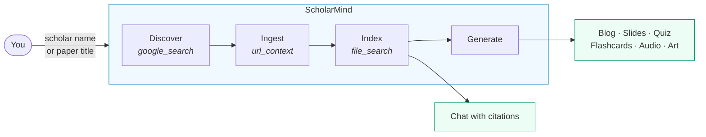
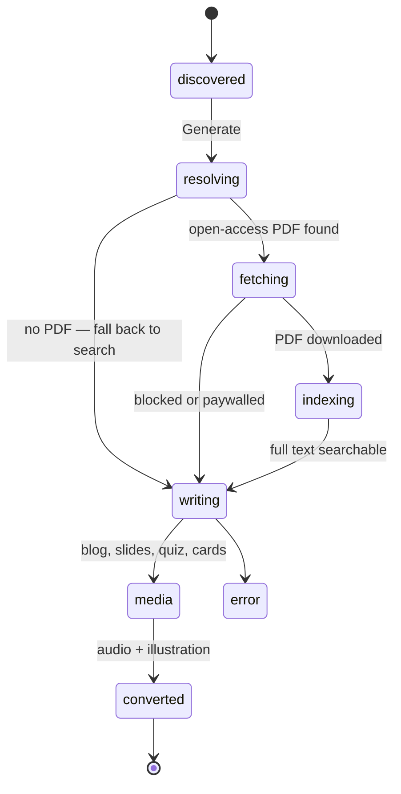
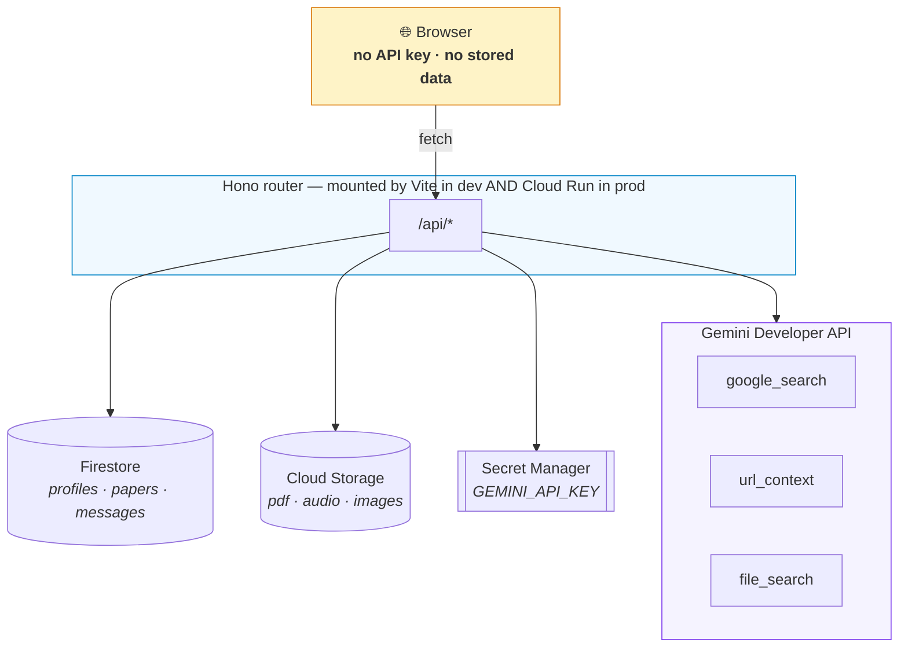
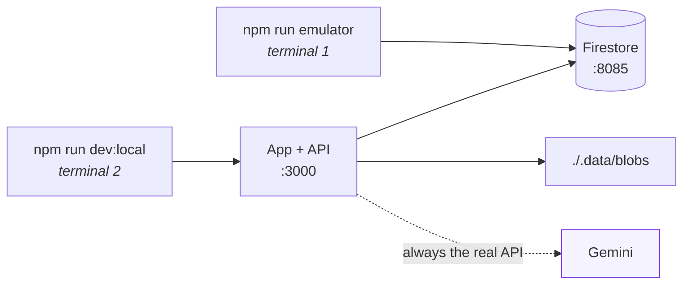

# 🎓 ScholarMind — AI Research Companion

ScholarMind turns academic papers into an interactive knowledge base. Point it at a scholar or a paper title, and it retrieves the open-access PDF, indexes the full text for semantic search, and generates a blog post, slides, a quiz, flashcards, narrated audio, and cover art — then answers questions grounded in what it actually read, with citations.

Built on Google Cloud: **Gemini** for generation and retrieval, **Firestore** for state, **Cloud Storage** for artifacts, **Cloud Run** for hosting. The same code runs locally.

---

## How it works



Each paper travels through a pipeline whose every step can fail without stopping the rest:



---

## Architecture



The browser holds no credentials and no state. **One router implementation** serves development and production, so nothing works locally but breaks when deployed.

→ [Architecture in depth](docs/architecture/README.md)

---

## Models

| Purpose | Model |
| :--- | :--- |
| Search, reasoning, generation, chat | `gemini-3.8-flash` |
| Cover illustrations | `gemini-3.1-flash-image` |
| Speech | `gemini-3.1-flash-tts-preview` |
| Retrieval embeddings | `gemini-embedding-2` |

Text uses the **Interactions API**; speech and images stay on `generateContent`.

---

## Quick start

**Needs** Node 22+, a [Gemini API key](https://aistudio.google.com/apikey), and Java 11+ for the Firestore emulator.

```bash
npm install
cp .env.example .env      # add GEMINI_API_KEY
```



Verify with `curl localhost:3000/api/healthz`:

```json
{"ok": true, "geminiKey": "configured", "firestore": "emulator", "blobs": "filesystem"}
```

> **No File Search emulator exists.** Retrieval always calls the real API, even locally. `FILE_SEARCH_STORE_PREFIX=dev-` keeps local stores identifiable.

→ [Development guide](docs/development/README.md)

---

## Deploy

```bash
gcloud builds submit --config cloudbuild.yaml
```

Deploys private (`--no-allow-unauthenticated`), expecting IAP in front.

→ [Deployment guide](docs/deployment/README.md)

---

## Two constraints worth knowing

Both were found by testing the live API, and both shape the design.

**Grounding tools are mutually exclusive.** File Search combines with neither Google Search nor URL Context — the API rejects it outright. So work is staged, and chat exposes a visible toggle rather than guessing.

**File Search corrupts structured JSON.** Its citation-insertion pass rewrites the `[` that opens a JSON array, so grounded structured generation reliably produces broken JSON. Generation therefore runs in two calls: grounded prose, then structuring with no tools.

→ [The full reasoning](docs/architecture/README.md#grounding-two-hard-constraints)

---

## Scripts

| Command | Purpose |
| :--- | :--- |
| `npm run dev:local` | App + API against the emulator |
| `npm run emulator` | Firestore emulator |
| `npm run build` | Production client build |
| `npm start` | Production server |
| `npm run typecheck` | `tsc --noEmit` |
| `npm run docker:build` | Container image |

## Layout

```
server/       router · repository · blobStore · gemini · ingest · export
components/   React UI
services/     api.ts — the browser's only server interface
docs/         architecture · development · deployment · features · sdlc
scripts/      live API verification spikes
```

## Docs

| | |
| :--- | :--- |
| [Architecture](docs/architecture/README.md) | Design and the reasoning behind it |
| [Development](docs/development/README.md) | Local setup, conventions, debugging |
| [Deployment](docs/deployment/README.md) | GCP provisioning end to end |
| [Features](docs/general/features.md) | User guide |
| [SDLC](docs/sdlc/README.md) | How this project is planned and built |

## License

MIT. Open source for educational and research purposes.
