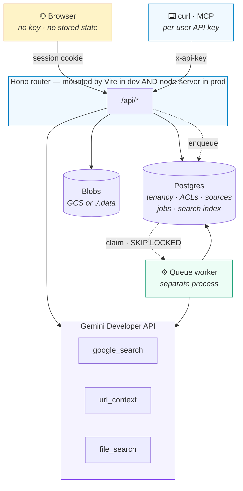

<div align="center">

# 🎓 ScholarMind

**Read a scholar's work. Then ask it questions.**

Point it at a researcher and it assembles their published work into a library
you can interrogate — grounded in what they actually wrote, with the passage
behind every answer.

[Features](docs/general/features.md) ·
[Architecture](docs/architecture/README.md) ·
[API](docs/api/README.md) ·
[Development](docs/development/README.md) ·
[Deployment](docs/deployment/README.md)

</div>

---

```
you  ▸  "Manindra Agrawal"

        ⟶  finds his publications, resolves open-access sources, indexes them
        ⟶  on a queue, while you do something else

you  ▸  "What is your view on primality testing?"

        ⟶  Based on Manindra Agrawal's published work: the AKS primality
           test gives the first deterministic polynomial-time algorithm…

           ▪ Primality and identity testing via Chinese remaindering
           ▪ PRIMES is in P

you  ▸  "What do you think about randomness in algorithms?"

        ⟶  Manindra Agrawal's work provided here does not cover that.
```

**That last answer is the point.** Asked something outside the indexed work, an
advisor declines — and declines *structurally*: when retrieval finds nothing
relevant, the model is never called, so there is nothing there to invent from.
A prompt instruction to abstain is advice. Not making the call is a guarantee.

---

## What it does

|  | |
| :-- | :-- |
| 📚 **Libraries that build themselves** | Name a scholar; their published work is found, resolved to open-access sources, downloaded and indexed. Add anything else too — PDFs, your own notes, web pages, Wikipedia, a talk on YouTube |
| 💬 **Answers you can check** | Every claim points at the passage it came from. Citations are the text actually retrieved, never something the model reported afterwards |
| 🎓 **Advisors** | Turn a library into someone you can consult. It answers from their published work in their register, and says so plainly when their work does not cover the question |
| 🔍 **Search across everything** | One query over every library you can reach, returning the passage that matched rather than a list of titles |
| 🤝 **Shared, deliberately** | Yours, your team's, or your organisation's — or shared with named people as viewer or editor. Build an advisor once; everyone consults the same one |
| ✨ **Read it back** | A write-up, slides, flashcards, a quiz, narration and cover art for any source. Bibliographies in BibTeX, APA, MLA, Chicago, Harvard or RIS |

---

## How it is put together



**One router implementation** serves development and production, so nothing
works locally but breaks when deployed.

**Work outlives the request.** Crawling a scholar takes minutes, so requests
enqueue and return a run id; the worker does the work and the client polls.
Closing the tab cancels nothing.

**Every resource belongs to an org, a team and an owner,** with a visibility and
optional per-person grants. The authorization predicate is part of the same
query as the data it guards — loading a resource *is* the check, so there is no
separate "may I?" call to forget.

---

## Three findings that shaped the design

Each was discovered by testing the live API, and each cost a debugging session.

**Grounding tools are mutually exclusive.** File Search combines with neither
Google Search nor URL Context. So work is staged — discover, ingest, ground —
and chat exposes a visible toggle rather than guessing which the user wanted.

**File Search corrupts structured JSON.** Its citation-insertion pass rewrites
the `[` that opens a JSON array, reliably. Grounded structured generation
therefore runs as two calls: grounded prose first, then structuring with no
tools attached.

**Retrieval cannot be scoped below a store — so the search index lives in
Postgres.** `metadataFilter` only matches the API's own recognised keys, and an
app-defined key silently matches *nothing*; a single call accepts at most five
stores. Under sharing, the set of libraries a person can see differs per person
and routinely exceeds five, so a store boundary cannot express it. In Postgres
the authorization predicate is a clause in the same query as the retrieval.

→ [The full reasoning](docs/architecture/README.md)

---

## Quick start

**Needs** Node 22+, Docker, and a [Gemini API key](https://aistudio.google.com/apikey).

```bash
npm install
cp .env.example .env       # add GEMINI_API_KEY
docker compose up -d db    # Postgres 17 + pgvector
npm run db:migrate
```

```bash
npm run dev:local          # terminal 1 — app + API on :3000
npm run worker             # terminal 2 — drains the job queue
```

> **Run the worker.** Without it, everything you ask for queues and nothing
> happens — the interface will sit at "queued" indefinitely.

Check it with `curl localhost:3000/api/healthz`:

```json
{"ok": true, "geminiKey": "configured", "database": "reachable", "acl": "disabled", "blobs": "filesystem"}
```

> **Semantic search needs one measured number.** `gemini-embedding-2`'s output
> dimension is not in this repository, and guessing it would reject every
> insert. Until it is supplied, search is keyword-only:
> ```bash
> GEMINI_API_KEY=… npm run spike:postgres    # read check G2
> EMBEDDING_DIM=<n> npm run db:migrate
> ```

→ [Development guide](docs/development/README.md)

---

## Using it from elsewhere

The browser, `curl` and MCP clients all hit the same router — there is no
separate integration API that can drift from what the app does.

```bash
# Mint a key from a signed-in session. Returned once; only a hash is stored.
curl -X POST $SM/api/keys -H 'content-type: application/json' \
  -d '{"name":"laptop","scope":"read"}'

curl -s "$SM/api/search?q=primality" -H "x-api-key: sm_3b140aeb7208_…"
```

A key **acts as its owner** and inherits their sharing exactly — no second
permission model to keep in step. A `read` scope can narrow what it may do,
never widen it, and no key may mint another.

→ [API & MCP reference](docs/api/README.md)

---

## Scripts

| | |
| :-- | :-- |
| `npm run dev:local` | App + API against the local database |
| `npm run worker` | Queue worker — nothing is processed without it |
| `npm run db:migrate` | Apply migrations (`db:reset` drops and rebuilds) |
| `npm test` | Vitest — pure logic, no network, no database |
| `npm run spike:postgres` | Check pgvector; **measure the embedding dimension** |
| `npm run spike:models` | List models a key can see; test tool-free candidates |
| `npm run build` · `npm start` | Production build and server |
| `npm run mcp` | MCP server over stdio |

Integration tests need a real database and are skipped unless
`TEST_DATABASE_URL` is set — deliberately not `DATABASE_URL`, since they drop
the schema.

---

## Documentation

**→ [`docs/`](docs/README.md)** — the index, with a map of which document
answers which question.

Before changing anything, read **[`CLAUDE.md`](CLAUDE.md)**: the constraints and
conventions that are load-bearing, and the ones that will bite you if you
ignore them.

---

## License

[MIT](LICENSE). Use it, modify it, ship it — commercially or otherwise. The only
condition is that the copyright notice travels with the code.

Note that the third-party services ScholarMind calls carry their own terms:
the [Gemini API](https://ai.google.dev/gemini-api/terms),
[Unpaywall](https://unpaywall.org/legal), and
[Crossref](https://www.crossref.org/documentation/retrieve-metadata/rest-api/).
Only open-access full texts are ever retrieved.
