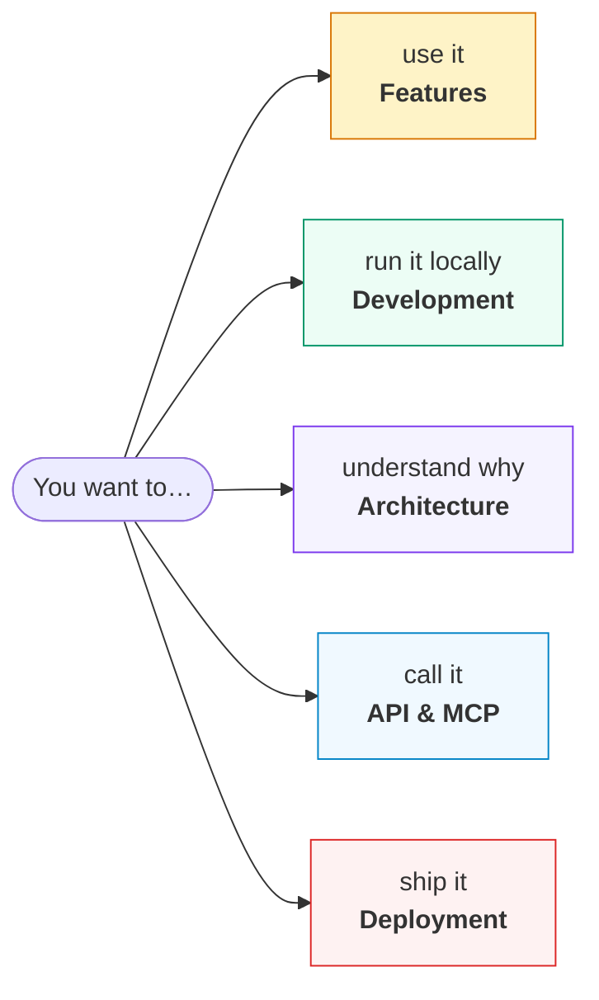

# Documentation

Five documents, each answering a different question. Start with the one that
matches what you are trying to do.



| | | |
| :-- | :-- | :-- |
| 📖 | **[Features & user guide](general/features.md)** | What the product does, written for someone using it. Signing in, building a library, advisors, sharing, search, citations, export |
| 🛠 | **[Development](development/README.md)** | Getting it running: Postgres in Docker, migrations, the worker, choosing models, running with ACLs on |
| 🏛 | **[Architecture](architecture/README.md)** | Why it is shaped this way. The tenancy model, the queue, and the live-API findings that dictated the retrieval design |
| 🔌 | **[API & MCP](api/README.md)** | Every endpoint, per-user API keys and their scopes, and the MCP server |
| ☁️ | **[Deployment](deployment/README.md)** | Provisioning GCP from nothing, written from an actual run — including what went wrong |
| 📋 | **[SDLC](sdlc/README.md)** | The plan → implement → test → release loop this repository is built with |
| ⚖️ | **[Comparison](comparison/README.md)** | Who else does this, and where ScholarMind loses to them. Written to be honest rather than flattering |
| 🧭 | **[Roadmap](plan/README.md)** | What is being built next and in what order — and what is deliberately not being built |

Plus **[`CLAUDE.md`](../CLAUDE.md)** at the root: the constraints and conventions
that are load-bearing, written for whoever changes the code next. If you read one
thing before making a change, read that.

Design records for larger pieces of work live in
[`.claude/plans/`](../.claude/plans/) — each carries the decisions taken, what
was verified, and where the implementation deviated from the plan.

---

## If you are in a hurry

**Run it:**

```bash
npm install
docker compose up -d db && npm run db:migrate
npm run dev:local        # terminal 1 — app + API on :3000
npm run worker           # terminal 2 — without this, nothing is processed
```

**Understand it:** the three findings in
[Architecture → grounding constraints](architecture/README.md) explain most of
why the code looks the way it does. They were found by testing the live API, and
each one cost a debugging session.

**Change it:** [`CLAUDE.md`](../CLAUDE.md), then the plan in
[`.claude/plans/`](../.claude/plans/) covering the area you are touching.
