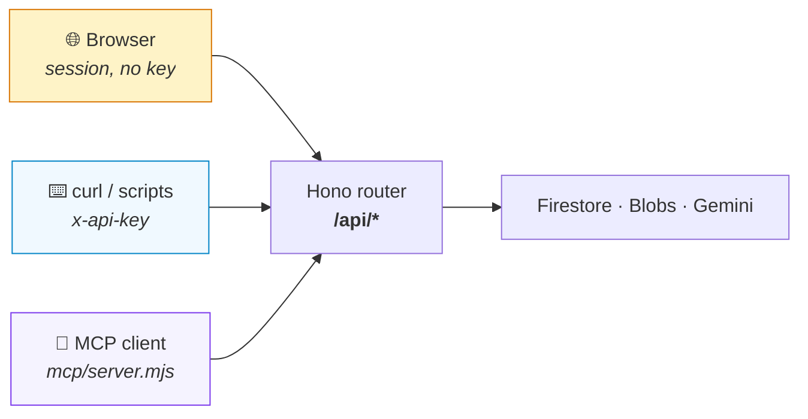
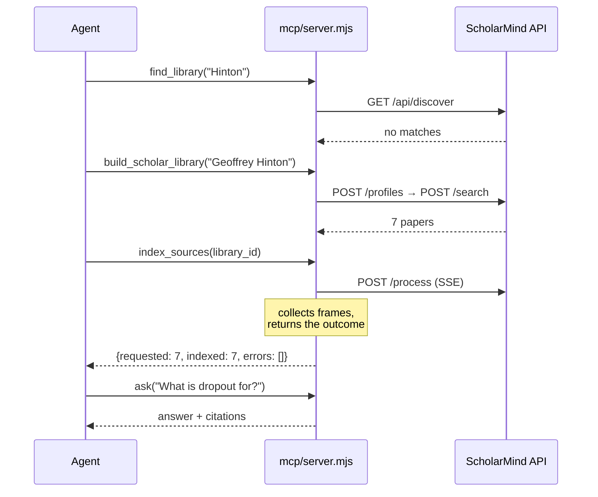

# API & MCP

ScholarMind is usable three ways, over one implementation. The browser, `curl`,
and an MCP client all hit the same Hono router — there is no separate
"integration API" that can drift from what the app actually does.



---

## Authentication

Set `SCHOLARMIND_API_KEY` in `.env`, then send it as `x-api-key` or a bearer token.

```bash
export SM=http://localhost:8080
export KEY=your-key-here

curl -s $SM/api/profiles -H "x-api-key: $KEY"
curl -s $SM/api/profiles -H "Authorization: Bearer $KEY"
```

Three outcomes, and the middle one is the one that matters:

| Request | Result |
| :--- | :--- |
| Correct key | Authenticated as the API user |
| **Wrong key** | **`401` — in every environment, including local development** |
| No key at all | The local browser session (dev), or IAP (production) |

A wrong key is refused even locally on purpose. The obvious implementation falls
through to the dev user when the key does not match, so a misconfigured
integration works perfectly on a laptop and fails only once deployed.

`/api/healthz` needs no authentication.

---

## Endpoints

### Libraries

| | | |
| :--- | :--- | :--- |
| `GET` | `/api/profiles` | Every library |
| `POST` | `/api/profiles` | Create one — `{title, emoji}` |
| `GET` | `/api/profiles/:id` | Library, sources and chat history |
| `PATCH` | `/api/profiles/:id` | Rename — `{title}` |
| `DELETE` | `/api/profiles/:id` | Delete it, its store and its blobs |
| `GET` | `/api/discover?q=` | Find existing libraries. No model call |

```bash
# Create a library
curl -s $SM/api/profiles -H "x-api-key: $KEY" -H 'content-type: application/json' \
  -d '{"title":"Transformers","emoji":"🤖"}'
# → {"id":"a1b2…","title":"Transformers","fileSearchStoreName":"fileSearchStores/…"}

# Is there already one for this scholar? Answered from stored identities.
curl -s "$SM/api/discover?q=Geoffrey+Hinton" -H "x-api-key: $KEY"
# → {"query":"Geoffrey Hinton","matches":[{"id":"…","title":"Geoffrey Hinton","exact":true,…}]}
```

### Adding things

| | | |
| :--- | :--- | :--- |
| `POST` | `/api/profiles/:id/search` | Build from a scholar — `{query, allowDuplicate?}` |
| `POST` | `/api/profiles/:id/papers/find` | Add one paper by title — `{query}` |
| `POST` | `/api/profiles/:id/sources` | Add any link — `{url}` |
| `POST` | `/api/profiles/:id/sources/upload` | Upload a file — multipart `file` |
| `GET` | `/api/profiles/:id/papers` | List everything in the library |
| `DELETE` | `/api/profiles/:id/papers/:paperId` | Remove one, and its indexed document |

```bash
# A scholar's library. 409 with {duplicate} if one already exists.
curl -s $SM/api/profiles/$ID/search -H "x-api-key: $KEY" -H 'content-type: application/json' \
  -d '{"query":"https://scholar.google.com/citations?user=JicYPdAAAAAJ"}'

# Any link — the kind is detected from the URL
curl -s $SM/api/profiles/$ID/sources -H "x-api-key: $KEY" -H 'content-type: application/json' \
  -d '{"url":"https://www.youtube.com/watch?v=aircAruvnKk"}'
# → {"kind":"youtube","title":"But what is a neural network?","extractedText":"…"}

# Upload a recording, a video or a document (≤50MB)
curl -s $SM/api/profiles/$ID/sources/upload -H "x-api-key: $KEY" \
  -F "file=@lecture.wav;type=audio/wav"
# → {"kind":"audio","title":"…","extractedText":"<transcript>"}
```

Refusals are explicit: `415` for an unsupported type, `413` over 50MB, `409` for
a link the library already has.

### Processing

`POST /api/profiles/:id/process` — `{paperIds: [...], mode}` — streams
server-sent events. The two halves are separate because they cost differently.

| `mode` | Does | Roughly |
| :--- | :--- | :--- |
| `index` | Fetch and embed, so chat can cite it | 5–10s per source |
| `artifacts` | Blog, slides, quiz, flashcards, audio, art | ~1min per source |
| `both` | Index, generate, then re-index against the write-up | The sum |

```bash
curl -sN $SM/api/profiles/$ID/process -H "x-api-key: $KEY" -H 'content-type: application/json' \
  -d '{"paperIds":["source-123"],"mode":"index"}'
```
```
event: paper
data: {"id":"source-123","stage":"fetching","indexStatus":"indexing"}

event: paper
data: {"id":"source-123","indexStatus":"indexed","indexedKind":"pdf","pdfReused":true}

event: done
data: {}
```

`pdfReused: true` means another library had already fetched that paper, so this
run skipped resolution and download entirely.

### Asking

`POST /api/chat` — `{profileId, message, useWebSearch}` — streams SSE.

**Omit `profileId` to ask across every library.** With one, the answer is scoped
to that library alone.

```bash
# Scoped to one library
curl -sN $SM/api/chat -H "x-api-key: $KEY" -H 'content-type: application/json' \
  -d '{"profileId":"'$ID'","message":"What problem does this solve?"}'

# Across everything
curl -sN $SM/api/chat -H "x-api-key: $KEY" -H 'content-type: application/json' \
  -d '{"message":"What do my libraries say about attention?"}'
```
```
event: delta
data: {"text":"Multi-head attention "}

event: citations
data: {"citations":[{"fileName":"Attention Is All You Need","snippet":"…"}]}

event: done
data: {"grounded":true,"searchedLibraries":["Transformers","Neural nets"],"skippedLibraries":2}
```

> `skippedLibraries` is not cosmetic. **File Search accepts at most five stores
> per call** — six returns `400`. A cross-library question searches the five most
> recently touched, and says which. See [architecture](../architecture/README.md).

### Citations

| | | |
| :--- | :--- | :--- |
| `GET` | `/api/profiles/:id/papers/:paperId/citation` | Every style for one source |
| `GET` | `/api/profiles/:id/citations?style=` | The whole bibliography |
| `GET` | `/api/profiles/:id/citations?style=&download=1` | As a `.bib` / `.ris` / `.txt` file |

Styles: `bibtex`, `apa`, `mla`, `chicago`, `harvard`, `ris`.

```bash
curl -s "$SM/api/profiles/$ID/citations?style=bibtex" -H "x-api-key: $KEY" | jq -r .text
curl -s "$SM/api/profiles/$ID/citations?style=ris&download=1" -H "x-api-key: $KEY" -o library.ris
```

Bibliographic detail comes from Crossref or not at all — never from the model.
`hasBibliographicData: false` means no Crossref record matched, so the citation
holds only what the library knows. Nothing is invented to fill the gaps.

### Media and export

| | | |
| :--- | :--- | :--- |
| `GET` | `/api/blobs/*` | A stored artifact. Ownership is checked against the key's profile |
| `GET` | `/api/profiles/:id/export` | The whole library as a ZIP |
| `POST` | `/api/tts` | Speech — `{text, voice}` → WAV |
| `GET` | `/api/healthz` | Which backends are live |

---

## MCP



### Register it

```bash
claude mcp add scholarmind -- node /absolute/path/to/scholar-mind/mcp/server.mjs
```

Or by hand, in an MCP client config:

```json
{
  "mcpServers": {
    "scholarmind": {
      "command": "node",
      "args": ["/absolute/path/to/scholar-mind/mcp/server.mjs"],
      "env": {
        "SCHOLARMIND_URL": "http://localhost:8080",
        "SCHOLARMIND_API_KEY": "your-key-here"
      }
    }
  }
}
```

The ScholarMind server must already be running — the MCP server is a client of
it, not a replacement for it.

### Tools

| Tool | Does |
| :--- | :--- |
| `list_libraries` | Every library, with source and indexed counts |
| `find_library` | Search by scholar, title or topic. No model call, no cost |
| `create_library` | An empty library |
| `build_scholar_library` | Create *and* populate from a scholar |
| `add_source` | Any link — page, Wikipedia, YouTube, PDF |
| `add_paper` | A paper by title |
| `list_sources` | Everything in a library, and whether it is indexed |
| `index_sources` | Embed for search. Defaults to everything unindexed |
| `generate_study_material` | Blog, slides, quiz, flashcards, audio, art |
| `read_study_material` | Read back what was generated |
| `ask` | Scoped to a library, or across all of them |
| `get_citation` | One source, every style |
| `export_bibliography` | The whole library in one style |

The intended order is **find before you build**: `find_library` is answered from
stored identities with no model call, so an agent that checks first never pays
to rediscover a library that already exists.

`index_sources` before `ask`, and `generate_study_material` only when someone
actually wants to read — it is roughly ten times slower than indexing and
produces nothing that chat needs.

### Worked example

```
find_library("Geoffrey Hinton")        → {"matches": []}
build_scholar_library("Geoffrey Hinton") → {"profileId": "a1b2", "papers": [7 papers]}
index_sources("a1b2")                  → {"requested": 7, "indexed": 7, "errors": []}
ask("What is dropout for?", "a1b2")    → {"answer": "…", "grounded": true,
                                          "citations": ["Improving neural networks by…"]}
get_citation("a1b2", "paper-0-…")      → {"citations": {"bibtex": "@article{…}", …}}
```

### Errors

Failures return as tool results with `isError: true` and the reason attached,
rather than as protocol exceptions — an agent can read `404 Not found` and pick
a different library, but cannot do anything with a transport error.

