# Architecture

A React SPA served by a small Node API. The browser is a view: no credentials, no persisted state. Everything durable lives in Firestore and Cloud Storage; every model call happens server-side.

> Replaces an earlier design where the browser called Gemini directly and stored everything — including base64 images and audio — in one localStorage key. That leaked the API key into the client bundle and exhausted the ~5MB quota after a handful of papers.

---

## The shape

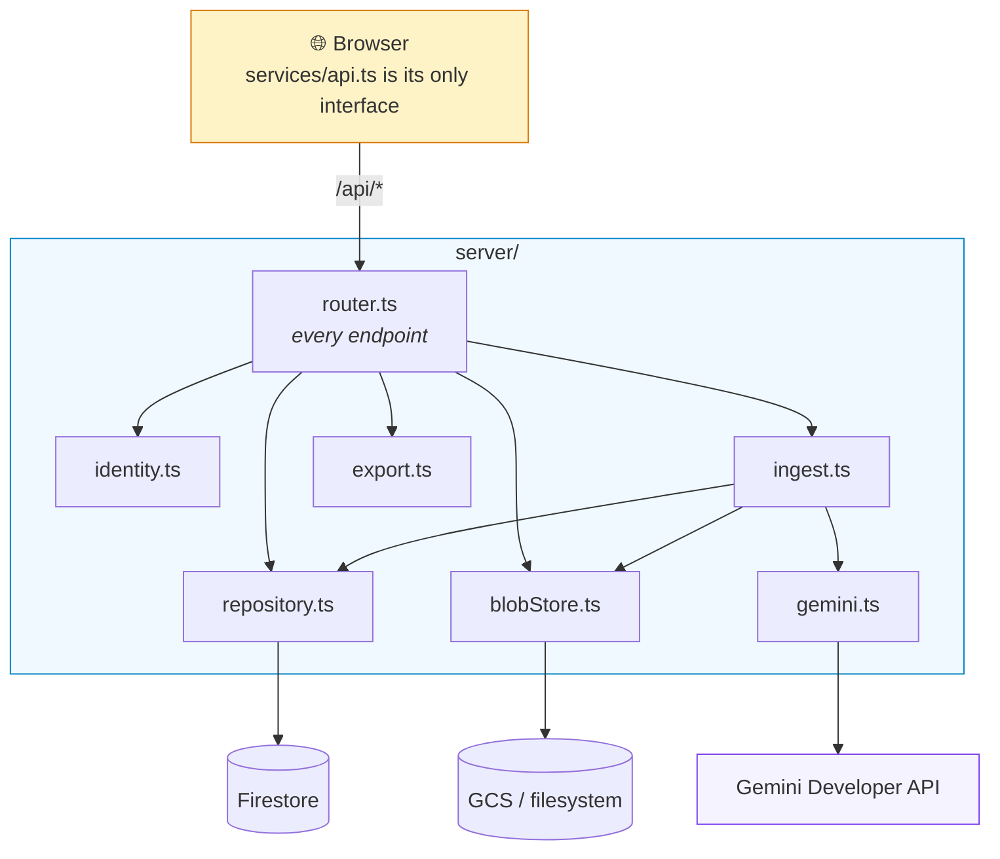

### One router, two hosts

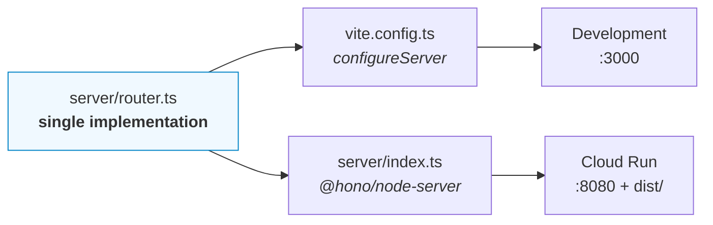

There is no separate development API, so there is no drift between environments. Do not add one.

---

## Data model

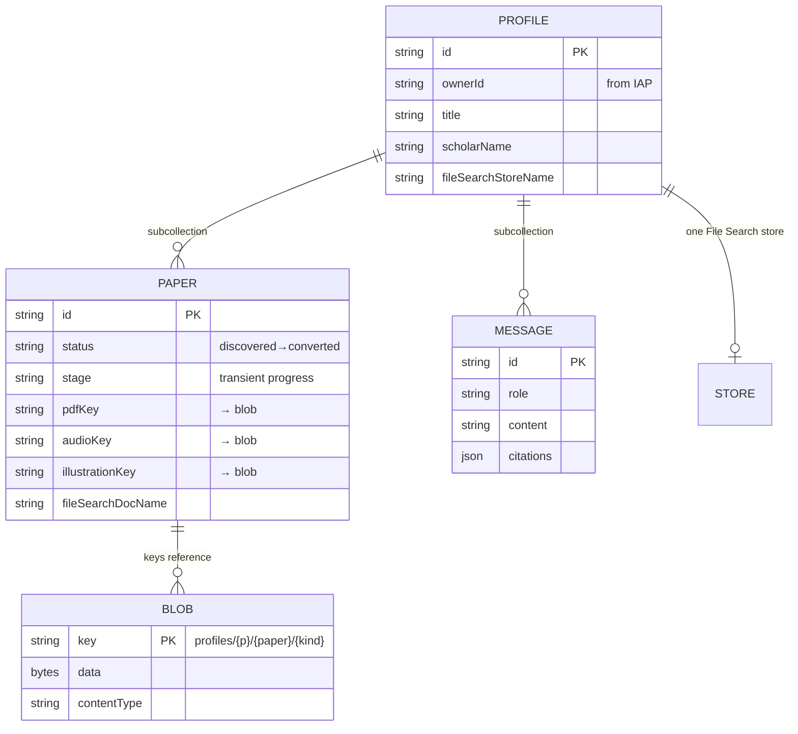

**Papers and messages are subcollections, not fields.** The previous model kept every paper inside one profile document, so editing a title rewrote the entire library. Writes are now proportional to what changed.

**Blobs are keys, never inline.** Bytes never enter React state or a Firestore document. `/api/blobs/*` checks ownership against the profile ID embedded in the key, so a key alone is not a capability.

---

## Grounding: two hard constraints

Both were found by testing the live API. Together they dictate the pipeline's shape.

### 1. Grounding tools are mutually exclusive

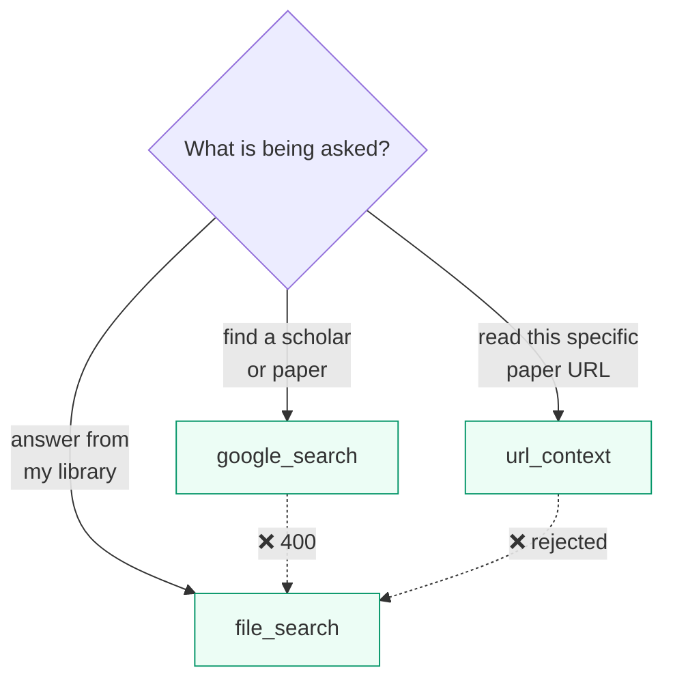

```
400 'google_search' and 'file_search' cannot be combined in the same request.
```

So work is staged — discover, then ingest, then answer — and chat exposes an explicit toggle rather than guessing which the user meant.

### 2. File Search corrupts structured JSON

Attaching File Search *while* requesting structured output produces malformed JSON, reliably, at the first array:

```
"title": "Combating Overfitting",
"points":.",            ← should be  "points": [
```

The preceding text always ends in a citation marker like `[3.5]`. The citation-insertion pass rewrites the `[` that opens the array. The response is otherwise complete and well-formed, so this is model-side corruption, not a parsing fault.

**Generation therefore runs in two stages:**

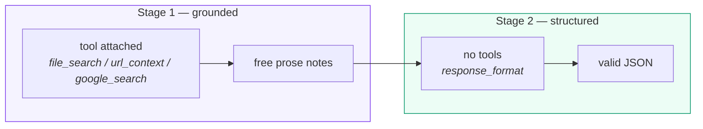

Any grounded structured generation needs two calls. See `generatePaperResources` in `server/gemini.ts`.

---

## Ingestion

`POST /profiles/:id/process` carries a `mode`, and the pipeline has two halves
that run independently:

| `mode` | Runs | Costs | Writes |
| --- | --- | --- | --- |
| `index` | resolve → fetch → embed | ~5–10s, one upload | `fileSearchDocName`, `indexStatus` |
| `artifacts` | grounded notes → structure → media | ~1min, five model calls | `blogContent`, `slides`, `quiz`, `audioKey`, `illustrationKey` |
| `both` | index, then artifacts, then re-index | the sum | all of the above |

They were one button. Splitting them follows from the cost asymmetry above:
making a library searchable is cheap and is what chat needs, while generating a
study module is slow and is what reading needs. Users want either without
waiting for the other.

Each half owns its own status field — `indexStatus` and `status` — so indexing a
finished paper does not hide its **Read** button, and generating does not clear
its **Indexed** badge.

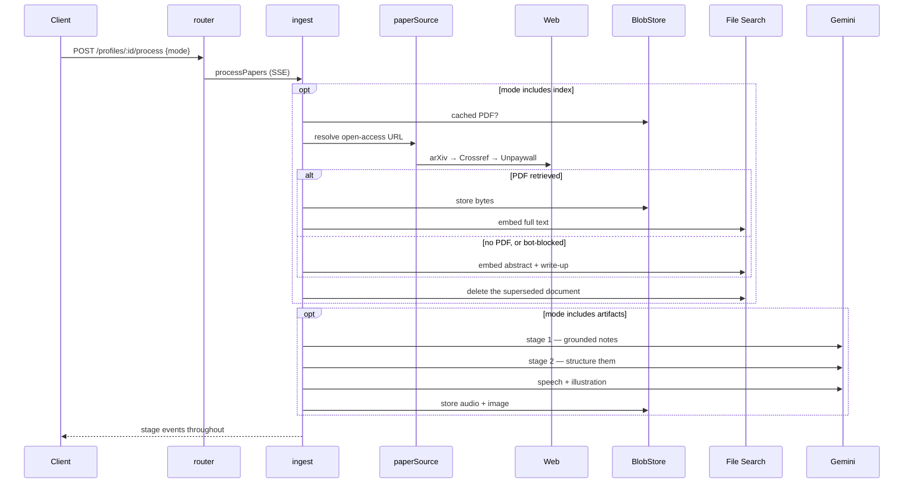

**Everything degrades, nothing blocks.** No PDF falls back to URL context, then to search grounding. When no PDF can be indexed, the abstract — and the *generated write-up*, once one exists — is indexed instead, so the library stays searchable even for paywalled sources. One bad paper cannot abort a run.

Re-indexing replaces rather than accumulates: the previous document is deleted
with `force: true`, since the API refuses to delete a document that still has
chunks. A paper first indexed from its abstract therefore upgrades cleanly to
its full text.

---

## Sources beyond papers

A library holds papers, web pages, Wikipedia articles, YouTube videos,
recordings and uploaded documents. One pipeline handles all of them because
every kind is **normalised to text once, at add time**.

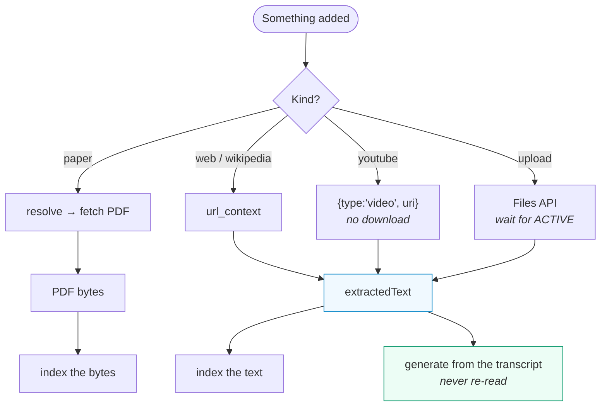

Extraction happens once. Generation reads `extractedText` rather than watching
the video again — which is what keeps a new modality from touching the rest of
the pipeline at all.

Three findings from the spike shaped this:

| Finding | Consequence |
| :--- | :--- |
| Interactions rejects `parts` — `400 Unknown parameter 'parts'` | Media uses its typed content blocks: `{type:'video'\|'audio'\|'document', uri}` |
| A YouTube URL works as a `video` block directly | No download, no storage, no transcoding |
| Media **does** compose with `response_format`, unlike grounding tools | Title and summary come back structured in one call |

Uploaded bytes live in the blob store like everything else. The Files API copy
is deleted as soon as extraction finishes rather than waiting out its 48-hour
retention.

---

## Citations

Formatted deterministically from stored metadata, enriched only from Crossref.

**Never from the model.** A hallucinated volume number or page range is worse
than a missing one: it looks authoritative, gets pasted into a bibliography, and
is wrong. Every field either came from the source, from Crossref's record of it,
or is omitted.

The Crossref match is exact-normalised-title only, and that strictness earns its
keep. Searching *"Attention Is All You Need"* returns *"Is Attention All You
Need?"* as its top hit — a different paper. A looser match would have attributed
that book chapter's DOI and pages to the Transformer paper.

The honest limitation: Crossref's free search often fails to surface a record
that exists. Neither `query.bibliographic` nor `query.title` returns the *Annals
of Mathematics* record for *"PRIMES is in P"*, even at 20 rows. So enrichment is
best-effort, and the UI distinguishes "this came from Crossref" from "no record
matched, and nothing was invented".

---

## Two ways in

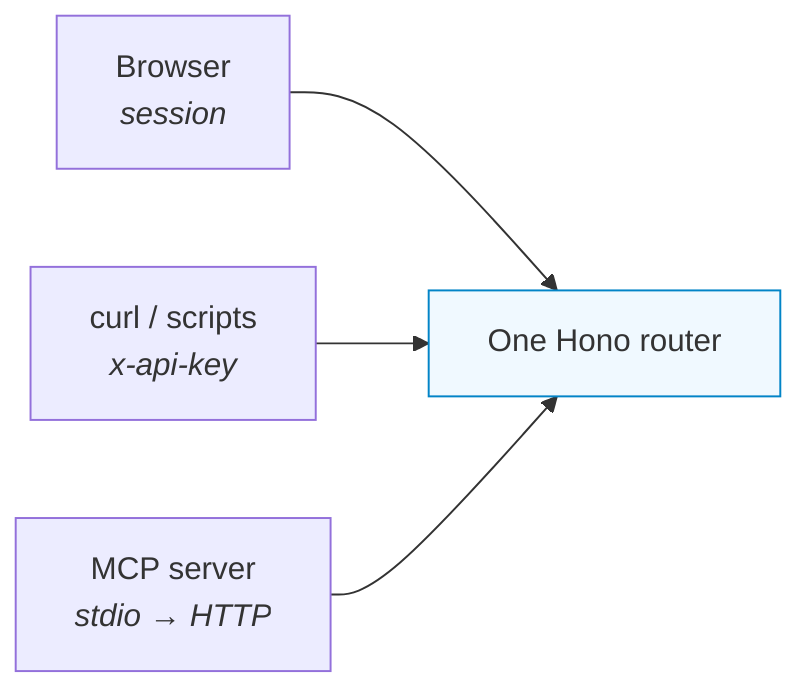

The MCP server is a **client of the HTTP API**, not a second implementation, so
an agent and a person cannot drift apart on what a library contains.

Authentication has three outcomes rather than two:

| Presented | Result |
| :--- | :--- |
| Correct key | The API user |
| **Wrong key** | **401, in every environment — including development** |
| No key | The dev user locally, IAP in production |

Refusing a wrong key locally is the point. The obvious implementation falls
through to the dev user on a mismatch, so a misconfigured integration works
perfectly on a laptop and fails only once deployed.

→ [API & MCP reference](../api/README.md)

---

## De-duplicating papers across profiles

Two profiles holding the same paper used to resolve it twice and download it
twice. The obvious fix — index it once into a shared store — does not work, and
the reason is worth recording because it looks like it should.

Verified against the live API:

| Attempt | Result |
| --- | --- |
| `metadataFilter: 'paperKey="arxiv-1111"'` (string) | matches **nothing** |
| `metadataFilter: 'paperNum=1000'` (app-defined numeric key) | matches **nothing** |
| `metadataFilter: 'year=2017'` (recognised key, same documents) | filters **correctly** |
| `metadataFilter: 'THIS IS NOT A FILTER'` | `400` — so the filter *is* parsed |
| Attach 5 stores to one call | works, retrieval is exactly those 5 |
| Attach **6** stores to one call | `400 Invalid input received` |

So retrieval can be scoped to a *store*, but not to a subset of one, and **five
stores per call** is the hard ceiling — far too few for store-per-paper to
scale, and the reason a cross-library question reports what it could not
search. **The per-profile
store boundary is the isolation mechanism.** A shared index with a filter would
have leaked one profile's library into another's answers.

What is shared instead is everything before the embedding:

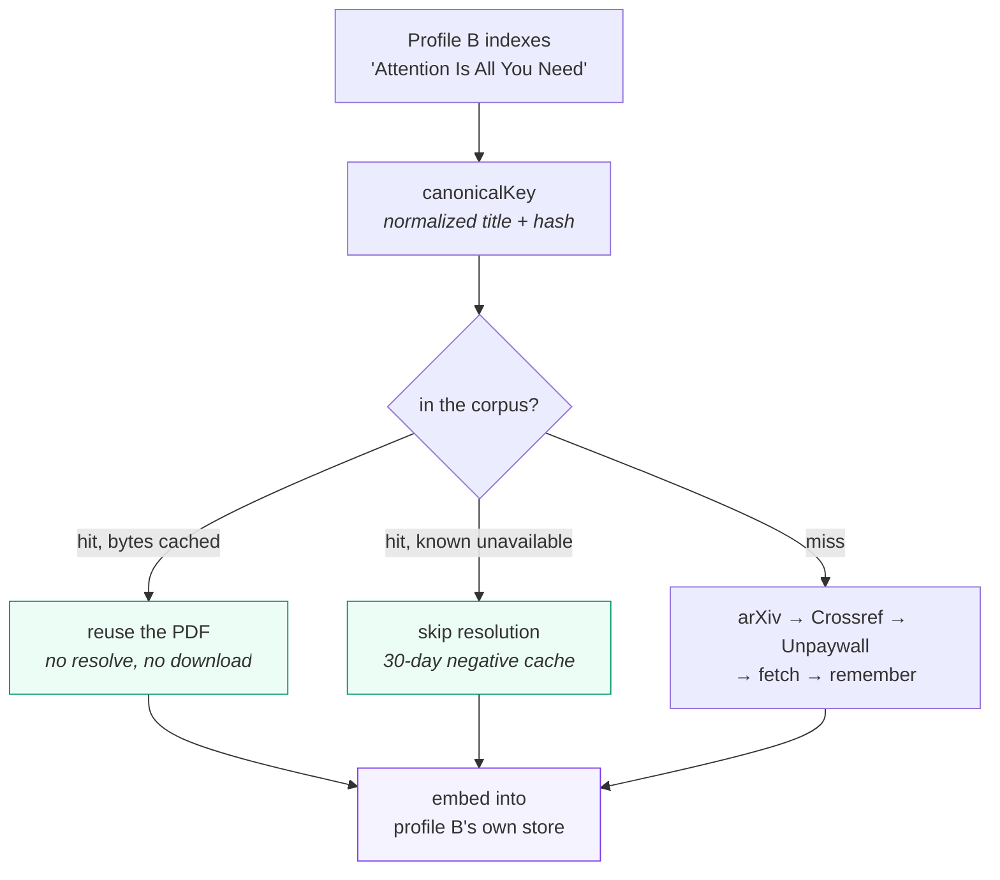

Measured: 10.6s cold, 5.2s reused. What remains is the upload-and-embed, which
is per-store and therefore irreducible.

The corpus is keyed by paper alone, not by owner, so it de-duplicates across
users as well as profiles. That is safe precisely because of what it holds:
public open-access PDFs and the URLs they came from. Generated write-ups, chat,
and anything else profile-specific stay inside the profile. Cached bytes live
under `corpus/`, outside every profile namespace, and `/api/blobs/*` only serves
keys under `profiles/` — so the shared cache is reachable by the server and
never by a browser.

---

## Why the Developer API, not Vertex

Vertex would allow ADC and no API key at all, which is otherwise preferable.

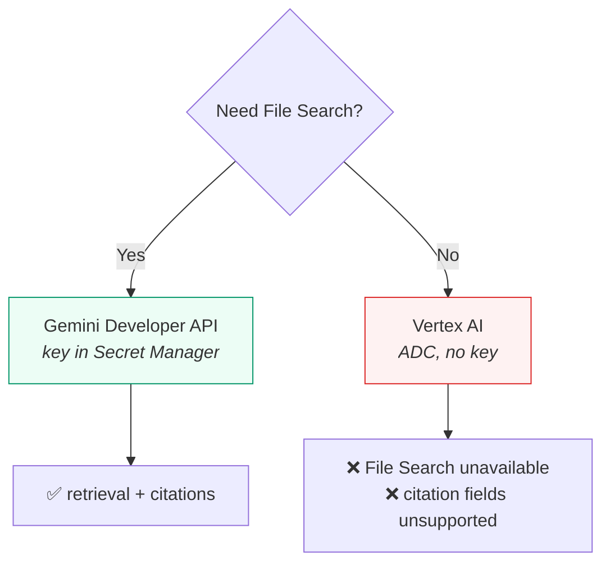

The SDK's own types say so — `genai.d.ts`: *"This data type is not supported in Vertex AI"* — and that covers the grounding fields carrying citations too. Vertex's equivalent is RAG Engine, a different API with a different resource model.

Since retrieval is central here, the Developer API is used in **every** environment. The gating is **runtime-only**: both `interactions` and `fileSearchStores` construct fine under `vertexai: true` and fail at call time, so a misconfiguration surfaces as a request error rather than a startup failure.

---

## Audio

Gemini TTS returns headerless 24kHz mono Int16 PCM (`audio/l16`) — not a playable file.

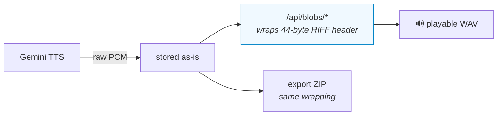

Wrapping server-side means the browser needs no sample conversion of its own.

---

## Identity

`server/identity.ts` verifies the **signed IAP JWT assertion** against Google's public keys. The plain `x-goog-authenticated-user-email` header is deliberately not trusted alone — anything able to reach the service directly could forge it. When `IAP_AUDIENCE` is unset the server **refuses** assertions rather than falling back. Development injects a stub user.

Firestore rules deny all direct client access: every read and write is mediated by the API server's service account.
