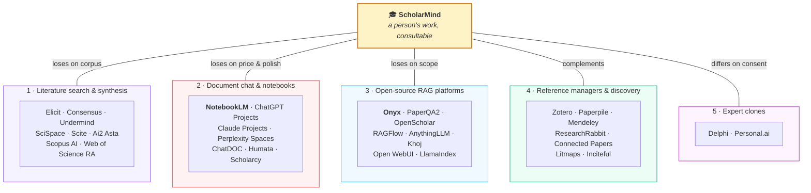
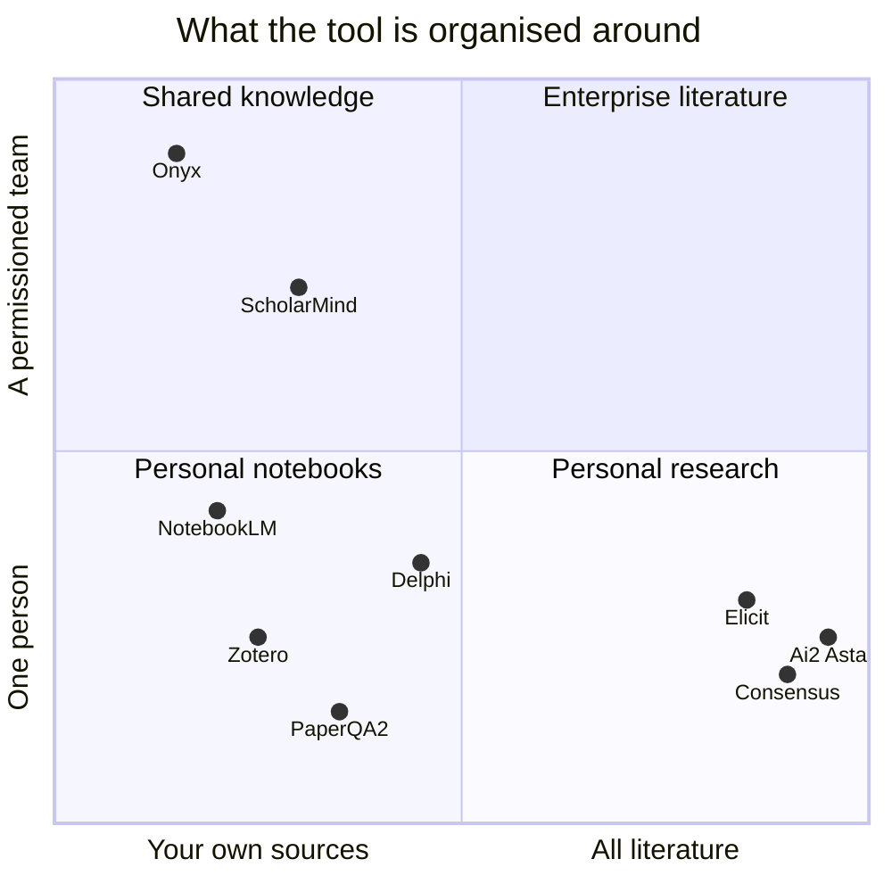

# Where ScholarMind stands

An honest competitive read, written to be useful rather than flattering. If you
are deciding whether to use this, **most of the reasons not to are on this
page** — the section that matters most is [Where it loses](#where-it-loses).

Checked against the market in September 2026. Sources at the bottom.

---

## The one-paragraph version

ScholarMind is a **person-shaped** research tool: name a scholar, get a library
of their published work, then consult it as an advisor that declines when the
work does not cover the question. Almost everything *around* that — grounded
chat over PDFs, citations, quizzes, flashcards, audio narration — is now a
commodity that Google gives away free. Almost everything *beneath* it —
permission-aware retrieval over a team's documents — is a category where a much
larger open-source project already exists. The defensible territory is narrow:
the advisor primitive, the abstention guarantee, and being MIT-licensed and
self-hostable while having a real ACL model. Outside that territory, the honest
answer to "why not use X instead?" is usually *you probably should*.

---

## The five things it competes with

Two of those five are genuine threats. The other three are context.

---

## 1 · Literature search and synthesis — lost on corpus, and it is not close

**Elicit, Consensus, Undermind, SciSpace, Scite, Ai2 Asta, Scopus AI, Web of
Science Research Assistant, Dimensions.**

| | Their index | ScholarMind's |
| :-- | :-- | :-- |
| Papers | SciSpace ~280M; Ai2 Asta rides Semantic Scholar's 200M+, with 108M abstracts and 12M full texts | Whatever a `google_search`-grounded model returned for one name, then whatever Unpaywall could resolve |
| Full text | Licensed and paywalled included | **Open access only.** By design, and permanently limiting |
| Recall | Measured, published, benchmarked | Unmeasured. There is no number in this repository |

They also ship whole capabilities that do not exist here: structured extraction
into custom columns, systematic-review screening at scale, journal-quality
filters and a consensus meter, citation-graph traversal, meta-analysis agents.
Entry paid tiers sit at roughly $10–20/month, with free tiers underneath.

**Verdict.** If the job is "survey a literature," ScholarMind is the wrong tool
and no amount of work on it will make it the right one. Its retrieval starts
from a *person*, not a question, and its corpus is a by-product of that choice.

---

## 2 · NotebookLM — the most dangerous competitor, because it is free

This is the comparison that decides most adoptions, so take it seriously.

| Feature | NotebookLM | ScholarMind |
| :-- | :-- | :-- |
| Grounded chat over your sources, with citations | ✅ | ✅ |
| Quizzes, flashcards | ✅ | ✅ |
| Audio narration of a source | ✅ (audio overviews) | ✅ |
| Sharing with viewer / editor roles | ✅ incl. bulk email share and public notebooks | ✅ |
| Price | Free tier, Google-scale reliability | Your Gemini bill, your Postgres, your Cloud Run |
| Finds the papers for you from a name | ❌ you bring the PDFs | ✅ |
| Cross-library search over everything you can reach | ❌ per-notebook | ✅ |
| Org / team tenancy, per-person grants, API keys | ❌ | ✅ |
| Advisor personas, panels, structural abstention | ❌ | ✅ |
| API, MCP, self-hosting | ❌ | ✅ |

**The brutal reading.** Six of ScholarMind's user-visible features are things
Google ships free and maintains better. Its "read it back" surface — write-up,
slides, flashcards, quiz, narration, cover art — is the *least* defensible part
of the product and the part most visible in a demo. The parts that actually
justify running your own instance (acquisition from a name, tenancy, advisors,
MCP) are invisible until someone has already committed.

If a prospective user's answer to "what would you do instead?" is *drop the PDFs
into NotebookLM*, they are right, unless they need sharing with real
permissions, a name-to-library step, or a programmatic interface.

---

## 3 · Open-source RAG — Onyx is bigger, and PaperQA2 is measured

**Onyx** (formerly Danswer) is the uncomfortable one. It is open source,
self-hostable via Docker Compose, Helm or Terraform, air-gappable with local
models, and ships 40+ connectors with *permission-aware retrieval that mirrors
source-system access*, plus SSO (OIDC/SAML/OAuth2), RBAC, MCP actions and deep
research.

ScholarMind's authorization design is genuinely nicer — one predicate, in the
same query as the data, so loading a resource *is* the check — but "nicer
predicate" is not a reason to choose a one-repository project over a platform
with connectors and SSO. Anyone shopping for *permissioned team knowledge* finds
Onyx first and should.

**PaperQA2** (FutureHouse) is the uncomfortable one on quality. It is
open-source scientific RAG with citation discipline, benchmarked at the top of
RAG-QA Arena's science split — reported ~12% above the next system — and it runs
over Zotero libraries. ScholarMind has **no published accuracy numbers at all**.
Its test suite deliberately covers pure logic and touches neither a model nor a
database. That is the right call for CI and it is not an evaluation.

Also here: **OpenScholar** (Ai2, 45M open-access papers with retriever plus
re-ranker), RAGFlow, AnythingLLM, Khoj, Open WebUI, and LlamaIndex/Haystack as
the assemble-it-yourself path.

**Verdict.** Against Onyx, ScholarMind loses on scope and wins only on being
research-shaped. Against PaperQA2, it currently loses on the only axis that
matters — measured answer quality — because it has not measured.

---

## 4 · Reference managers and discovery — not really competitors

Zotero, Paperpile, Mendeley, EndNote own the collection. ResearchRabbit,
Connected Papers, Litmaps and Inciteful own the citation graph. ScholarMind
does neither, and exports citations without being able to import a library.

**This is the cheapest strategic fix on the page:** Zotero import would turn the
largest incumbent workflow from a competitor into an input. PaperQA2 already
reads Zotero. ScholarMind does not.

---

## 5 · Expert clones — same shape, opposite consent model

**Delphi** builds a "Digital Mind" from a person's books, articles, podcasts and
videos, with voice, monetisation, a $79–299/month ladder and a $16M Sequoia-led
Series A. That is the closest commercial analogue to the advisor feature.

The difference is who agrees. Delphi clones *you*, with your participation, for
your audience. ScholarMind builds an advisor from a third party's published work
without asking them — which is why the guardrails are structural rather than
cosmetic: the persona shapes register and standpoint, never facts, and an
advisor with no relevant retrieved passages is not asked at all.

**The brutal reading.** That design is defensible and it is still the product's
largest reputational exposure. "AI version of a named living academic, built
without their involvement" is a headline before it is a feature, and no
architecture diagram argues with a headline. Expect to have to explain it.

---

## Where it wins

Four things, and they are narrower than the feature list suggests.

**The advisor primitive.** No tool in groups 1–4 lets you consult *a named
scholar's body of work in their register* and get an honest refusal outside it.
Panels — several advisors on one question — have no equivalent anywhere.

**Abstention as a structural property.** When retrieval returns nothing
relevant, `askAdvisor` returns the abstention **without a model call**. Everyone
else instructs a model to say "I don't know" and hopes. A prompt is advice; an
absent call is a guarantee. This is the single most defensible claim in the
project.

**Authorization inside retrieval.** The ACL predicate is a clause in the same
query as the search, so the visible set is per-viewer and unbounded — which is
precisely what File Search's five-store limit could not express. Sharing a
library shares the advisor built on it.

**One surface.** Browser, `curl` and MCP hit the same router; a key acts as its
owner and inherits sharing exactly, with no second permission model. Most
competitors have an app *and* an API that drift.

---

## Where it loses

Read this section twice.

| | The gap |
| :-- | :-- |
| **Corpus** | Open access only. No paywalled full text, no licensed metadata, no citation graph, no recall guarantee. Discovery is a grounded model call, not an index |
| **No evaluation** | Zero published accuracy numbers. PaperQA2 has benchmarks; this has a philosophy |
| **Thin libraries** | A crawled-but-unenriched paper is ~200 characters. Retrieval over it is weak, and the product exposes the fix as a button the user has to know to press |
| **Single vendor** | Bound to the Gemini Developer API — File Search is unavailable on Vertex, so there is no BYO-model or local-model path. That forfeits the air-gapped and regulated-sector cases outright |
| **Commodity surface** | Chat, citations, quizzes, flashcards, narration: all free in NotebookLM |
| **No imports** | Exports six citation formats, imports no reference manager |
| **Operationally heavy** | Postgres, a worker process, blob storage, a measured embedding dimension — against a competitor that is a URL |
| **Semantic search is opt-in** | Until `EMBEDDING_DIM` is supplied, retrieval is keyword-only. The degradation is invisible in tests and obvious in use |
| **No hosted offering, no compliance story** | No SaaS, no SOC 2, no SSO. Group 3 has all three |

---

## Positioning

The gap ScholarMind sits in is real but small: **permissioned, self-hosted,
person-centred research**. Onyx owns permissioned-and-self-hosted without the
research shape; Elicit and Asta own the research shape without permissions or
self-hosting; NotebookLM owns easy at zero cost.

---

## Who should not use this

- Anyone doing a **systematic review or literature survey** → Elicit, or Ai2 Asta
- Anyone who needs **paywalled full text** → Scopus AI, Web of Science, SciSpace
- Anyone who just wants to **chat with PDFs they already have** → NotebookLM, free
- Anyone wiring up **a company's documents with SSO and connectors** → Onyx
- Anyone who needs **benchmarked answer accuracy on record** → PaperQA2
- Anyone who wants a **clone of themselves, with their consent and their voice** → Delphi

## Who should

- Anyone who wants to ask *a specific researcher's work* questions, repeatedly
- A lab or team that wants to **build an advisor once and share it**, with real
  per-person permissions, on infrastructure they control
- Anyone who needs research retrieval **behind an API or MCP** rather than in a
  web app
- Anyone for whom **a wrong confident answer is worse than no answer** — that is
  the only requirement this project treats as non-negotiable

---

## What would change this page

In rough order of how much each would move the assessment:

1. **Publish accuracy numbers.** An evaluation set of questions with known
   answers, run against real libraries. Without this, every quality claim here is
   an argument from architecture.
2. **Zotero / BibTeX import.** Turns the largest incumbent into an input.
3. **A model-agnostic path.** Retrieval already lives in Postgres and the
   tool-free calls already read `plainModel()`; a local-model option would open
   the self-hosted case that Onyx currently wins uncontested.
4. **Make thin libraries impossible,** or at least loud. Enrichment is what makes
   retrieval good and it is currently the user's problem.
5. **Say the abstention claim on the landing page,** with a demo of a refusal.
   It is the strongest thing here and it is visible only after signing in.

---

## Sources

Market claims on this page were checked in September 2026 against:
[Onyx on self-hosted RAG](https://onyx.app/insights/self-hosted-rag) ·
[Onyx enterprise RAG buyer's guide](https://onyx.app/insights/enterprise-rag-platforms-2026) ·
[PaperQA2 on RAG-QA Arena](https://www.futurehouse.org/research-announcements/paperqa2-achieves-sota-performance-on-rag-qa-arena-science-benchmark) ·
[paper-qa](https://github.com/future-house/paper-qa) ·
[Ai2 Asta](https://allenai.org/blog/asta) ·
[NotebookLM public notebooks](https://blog.google/innovation-and-ai/models-and-research/google-labs/notebooklm-public-notebooks/) ·
[NotebookLM April 2026 update](https://minssam.com/en/blog/notebooklm-april-2026-auto-label-bulk-share-flashcard/) ·
[Elicit vs SciSpace](https://scispace.com/compare/elicit) ·
[Elicit vs Consensus](https://paperguide.ai/blog/elicit-vs-consensus/) ·
[Delphi review](https://creatoreconomytools.com/tool/delphi).

Competitor feature sets move monthly. Re-check before quoting this anywhere it
matters.
