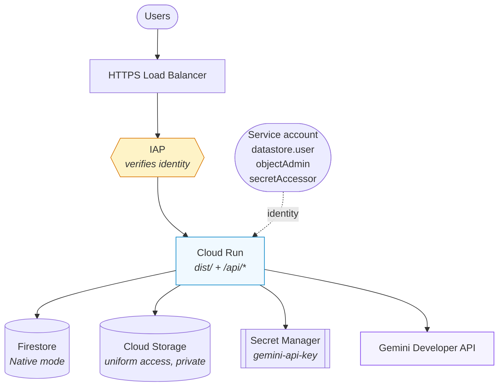
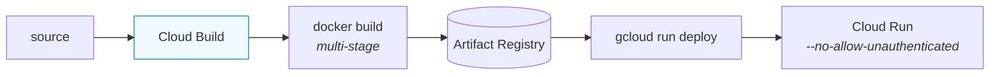
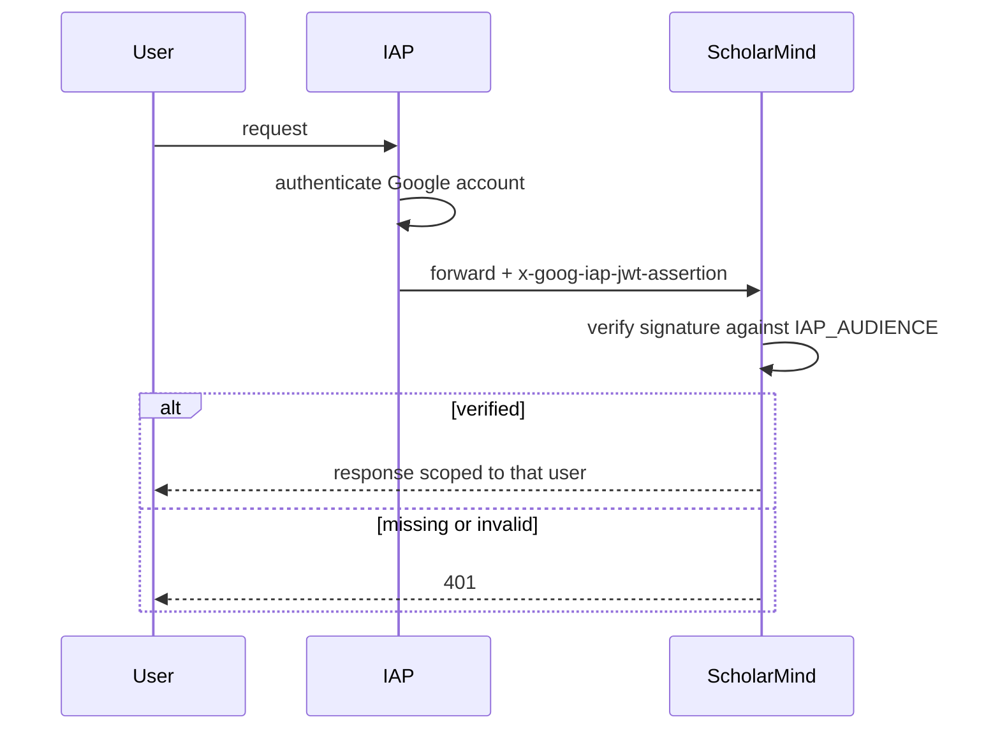

# Deployment

One Cloud Run service serves both the built SPA and the API. One container, one origin, no CORS configuration.

> The previous version of this document described a static frontend and warned that "the API key is exposed to the browser." No longer true: the key is server-side only and never enters the client bundle.

---

## Target topology



## Build and release



---

## Prerequisites

```bash
export PROJECT_ID=$(gcloud config get-value project)
export REGION=us-central1
export SERVICE=scholarmind
```

## 1. Enable APIs

```bash
gcloud services enable \
  run.googleapis.com cloudbuild.googleapis.com artifactregistry.googleapis.com \
  firestore.googleapis.com storage.googleapis.com secretmanager.googleapis.com \
  iap.googleapis.com
```

## 2. Firestore

```bash
gcloud firestore databases create --location=$REGION
```

Native mode. Only document reads and simple ordered queries are used, so no composite indexes are needed initially — Firestore names any it wants in an error message.

## 3. Cloud Storage

```bash
gsutil mb -l $REGION gs://$PROJECT_ID-scholarmind
gsutil uniformbucketlevelaccess set on gs://$PROJECT_ID-scholarmind
```

No public access. Bytes are streamed through `/api/blobs/*` so ownership is checked on every read.

## 4. Secret Manager

```bash
printf 'YOUR_GEMINI_API_KEY' | gcloud secrets create gemini-api-key --data-file=-
```

The Developer API key is required because [File Search is unavailable on Vertex](../architecture/README.md#why-the-developer-api-not-vertex).

## 5. Service account

Dedicated, not the default compute account:

```bash
gcloud iam service-accounts create $SERVICE --display-name="ScholarMind runtime"
SA=$SERVICE@$PROJECT_ID.iam.gserviceaccount.com

gcloud projects add-iam-policy-binding $PROJECT_ID \
  --member=serviceAccount:$SA --role=roles/datastore.user
gcloud secrets add-iam-policy-binding gemini-api-key \
  --member=serviceAccount:$SA --role=roles/secretmanager.secretAccessor
gsutil iam ch serviceAccount:$SA:objectAdmin gs://$PROJECT_ID-scholarmind
```

## 6. Artifact Registry

```bash
gcloud artifacts repositories create $SERVICE --repository-format=docker --location=$REGION
```

## 7. Deploy

```bash
gcloud builds submit --config cloudbuild.yaml
```

| Flag | Why |
| :--- | :--- |
| `--no-allow-unauthenticated` | A public URL in front of a Gemini key is a cost liability |
| `--timeout=300s` | Ingestion plus two-stage generation is slow |
| `--memory=1Gi` | PDFs are buffered in memory during indexing |
| `--min-instances=0` | Scales to zero; accepts cold starts |
| `--set-secrets` | Key injected at runtime, never baked into the image |

## 8. IAP

Deployed private, the service needs IAP for real users — and IAP supplies the identity the app stores data against.



1. Put an external HTTPS load balancer in front of the service (serverless NEG).
2. Enable IAP on the backend service.
3. Grant access:

```bash
gcloud iap web add-iam-policy-binding \
  --resource-type=backend-services --service=YOUR_BACKEND_SERVICE \
  --member=user:someone@example.com --role=roles/iap.httpsResourceAccessor
```

4. Set `IAP_AUDIENCE` to `/projects/PROJECT_NUMBER/global/backendServices/BACKEND_SERVICE_ID`.

> **Without `IAP_AUDIENCE` the server rejects every request in production.** Deliberate: it will not accept an unverified identity header.

---

## Environment

| Variable | Required | Notes |
| :--- | :--- | :--- |
| `GEMINI_API_KEY` | ✅ | From Secret Manager |
| `GOOGLE_CLOUD_PROJECT` | ✅ | Set by Cloud Run |
| `GCS_BUCKET` | ✅ | Absent falls back to local disk, which is ephemeral on Cloud Run |
| `IAP_AUDIENCE` | ✅ | Assertions refused without it |
| `NODE_ENV=production` | ✅ | Enables IAP verification |
| `UNPAYWALL_EMAIL` | — | Enables Unpaywall lookup; their terms require a contact address |
| `FILE_SEARCH_STORE_PREFIX` | — | Separates environments |

## Verify

```bash
TOKEN=$(gcloud auth print-identity-token)
curl -H "Authorization: Bearer $TOKEN" https://YOUR_SERVICE_URL/api/healthz
```

Expect `geminiKey: "configured"`, `firestore: "cloud"`, `blobs: "gcs"`. Unauthenticated requests should return 401.

## Cost

Cloud Run scales to zero; Firestore and Storage usage is small. **Gemini dominates:** each processed paper is two generation calls plus speech and image generation, and File Search charges for embeddings at indexing time.
