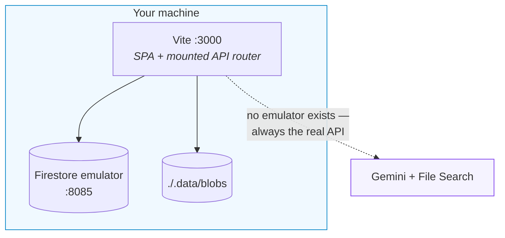
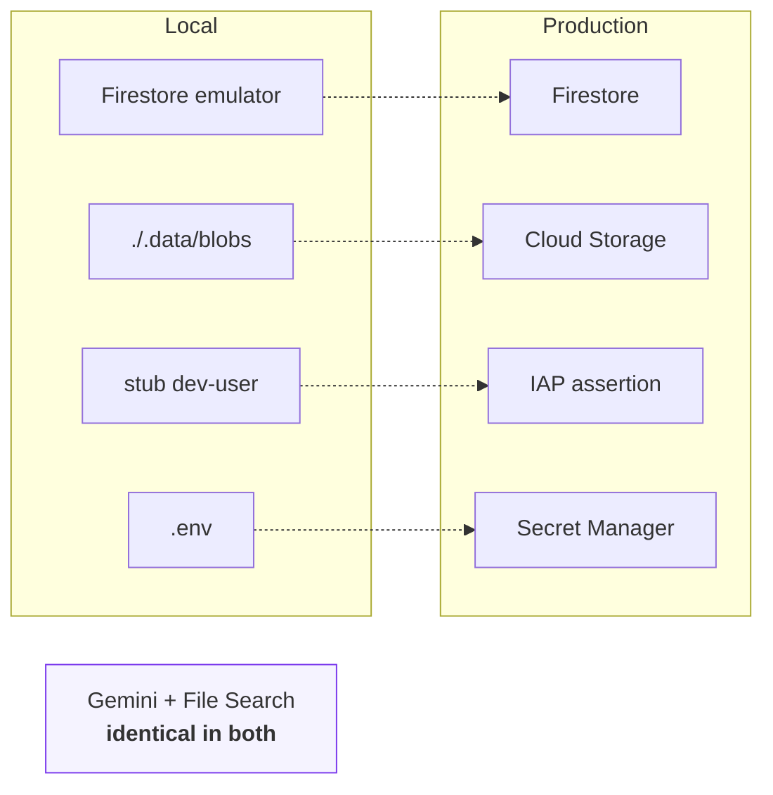
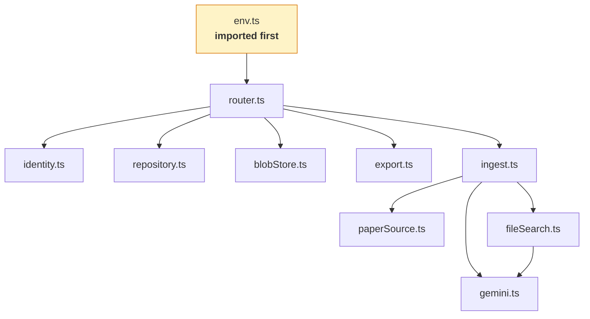
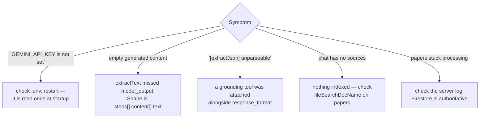

# Development

## Setup

Node 22+, Java 11+ (Firestore emulator), a [Gemini API key](https://aistudio.google.com/apikey).

```bash
npm install
cp .env.example .env     # add GEMINI_API_KEY
```

`.env` is git-ignored; `.env.example` documents every variable the code reads.

## Run

```bash
npm run emulator     # terminal 1 — Firestore on :8085
npm run dev:local    # terminal 2 — app + API on :3000
```



Check state at any time:

```bash
curl localhost:3000/api/healthz
{"ok":true,"geminiKey":"configured","firestore":"emulator","blobs":"filesystem"}
```

`geminiKey: "MISSING"` means `.env` is absent or empty — the server also warns loudly at startup.

### Port conflicts

A Docker container publishing `127.0.0.1:3000` silently shadows Vite's bind. Use another port:

```bash
npm run dev:local -- --port 5180
```

---

## What differs between local and production



**There is no File Search emulator.** Retrieval always hits the real API and creates real stores, which cost embedding tokens at indexing time. Set `FILE_SEARCH_STORE_PREFIX=dev-` so local stores are identifiable, and clean them up periodically.

### Against real GCP services

```bash
gcloud auth application-default login
```

Unset `FIRESTORE_EMULATOR_HOST`, set `GOOGLE_CLOUD_PROJECT` and `GCS_BUCKET`. Use a development project — the app writes real data.

---

## Module map



### `server/env.ts` must be imported first

ES module imports are evaluated **before** module-level statements, so a loader called at the top of an entry file still runs *after* imported modules have read `process.env`. `env.ts` is a side-effect module imported first in both entry points. Keep it that way.

---

## Conventions

**Error contracts are load-bearing.**

| Function | On failure |
| :--- | :--- |
| `searchScholarAndPapers` | re-throws, so the UI can surface it |
| `findCitingPapers`, `generateAudio`, `generateIllustration` | return empty |
| `generatePaperResources` | returns a placeholder |

The last one is why a single bad paper cannot abort a batch. Preserve these.

**Everything degrades.** No PDF → URL context → search grounding. A missing artifact must never block a paper.

**Bytes never enter React state or Firestore.** `Paper` carries `illustrationKey` / `audioKey` / `pdfKey`.

**Grounding is exclusive, and structured output needs its own call.** See [architecture](../architecture/README.md#grounding-two-hard-constraints).

---

## Verification spikes

```bash
node scripts/spike-phase0.mjs        # read-only
node scripts/spike-phase0b.mjs       # creates and deletes a File Search store
```

These probe the live API for the behaviour this codebase depends on: model availability, tool composition, `response_format` shape, interaction step structure. Run them after an SDK upgrade or a model deprecation — they fail loudly if an assumption has changed.

## Debugging



Server logs appear in the Vite terminal — the API runs in that process.

## Typechecking

```bash
npm run typecheck
```

## Tests

```bash
npm test          # vitest run — pure logic, no network
npm run test:watch
```

See [sdlc](../sdlc/README.md#test) for what is covered and what is deliberately not.

## Housekeeping

```bash
node scripts/reconcile-stores.mjs            # report File Search stores no profile references
node scripts/reconcile-stores.mjs --delete   # remove them
```

Store deletion on profile delete is best-effort, so failures leak stores that
count against project quota. Run this occasionally. It only ever considers
stores matching this app's display-name convention.
