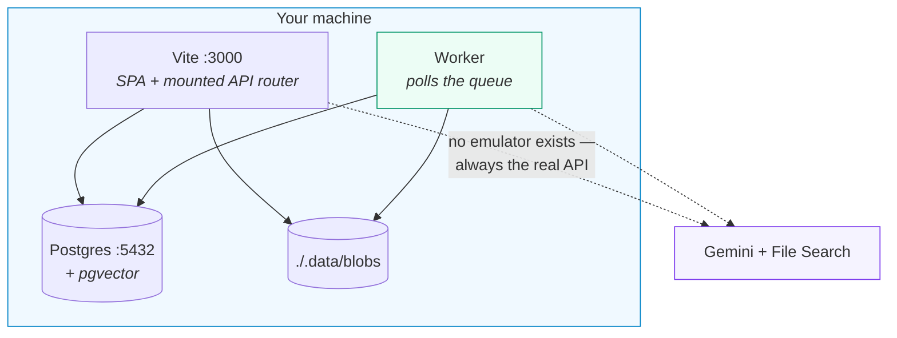
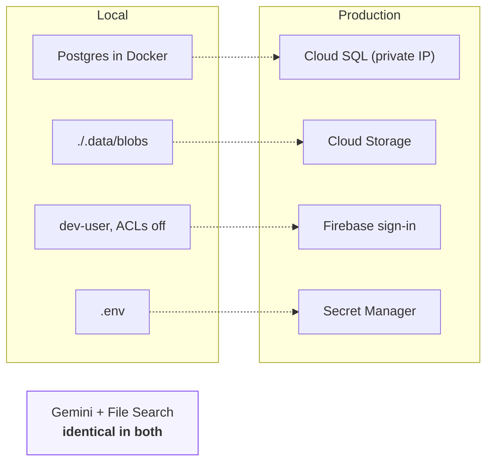
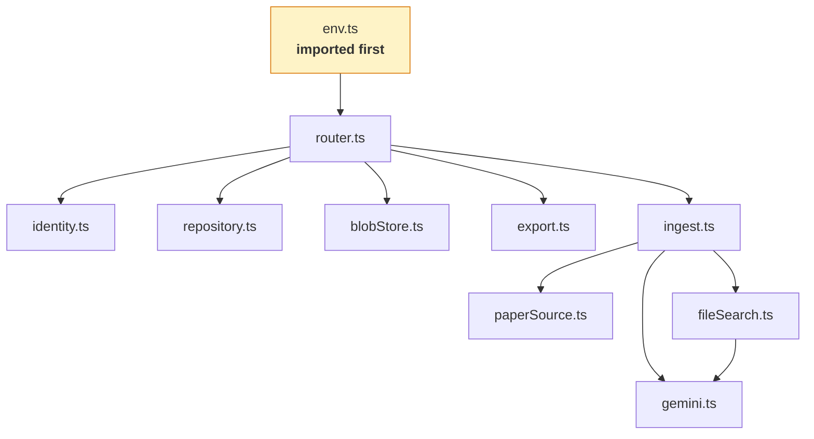
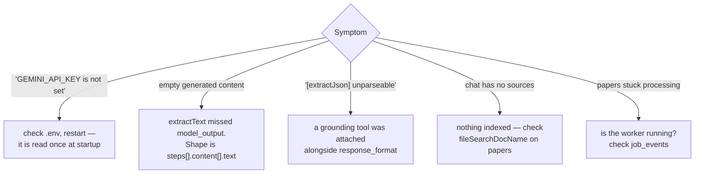

# Development

## Setup

Node 22+, Docker, a [Gemini API key](https://aistudio.google.com/apikey).

```bash
npm install
cp .env.example .env      # add GEMINI_API_KEY
docker compose up -d db   # Postgres 17 + pgvector on :5432
npm run db:migrate
```

`.env` is git-ignored; `.env.example` documents every variable the code reads.

## Run

Two processes. The second is not optional — without a worker, everything you ask
for is queued and nothing happens.

```bash
npm run dev:local    # terminal 1 — app + API on :3000
npm run worker       # terminal 2 — drains the job queue
```



Check state at any time:

```bash
curl localhost:3000/api/healthz
{"ok":true,"geminiKey":"configured","database":"reachable","acl":"disabled","blobs":"filesystem"}
```

`geminiKey: "MISSING"` means `.env` is absent or empty — the server also warns
loudly at startup. `database: "UNREACHABLE"` means the container is not running.

### Migrations

Numbered plain SQL in `server/db/migrations/`, applied in filename order, each in
its own transaction.

```bash
npm run db:migrate    # apply what is pending
npm run db:reset      # drop the schema and rebuild (development only)
```

One migration needs a value that is not in this repository. `0004_embeddings.sql`
adds `chunks.embedding vector(N)`, where N is the output dimension of
`gemini-embedding-2` — a property of the model, never written down here.

**Do not guess it.** A wrong dimension rejects every insert, and correcting it
later means rebuilding the whole index.

```bash
GEMINI_API_KEY=… npm run spike:postgres   # check G2 prints the number
EMBEDDING_DIM=<n> npm run db:migrate
```

The migration declares itself `-- deferrable`, so until you supply it the other
migrations apply normally and **search runs keyword-only**. That is invisible in
the tests and obvious in use: a question phrased unlike the source text returns
little or nothing.

### Choosing models

Grounded and ungrounded calls are separate settings, because only one of them is
free to change.

Anything using `google_search`, `url_context` or `file_search` stays on
`gemini-3.8-flash`. A search that quietly stops grounding does not error — it
returns a fluent, invented publication list, and nothing downstream can tell the
difference.

Calls attaching **no tools** read `PLAIN_TEXT_MODEL`: advisor answers, panel
synthesis, cross-library chat and the structuring pass all carry their passages
in the prompt, so they need nothing Gemini-specific.

```bash
GEMINI_API_KEY=… npm run spike:models          # what this key can see
GEMINI_API_KEY=… npm run spike:models gemma-3-27b-it   # test a candidate
```

The spike reports a model *refusing* an attached tool as the good outcome. The
dangerous case is one that accepts `google_search` and ignores it: that looks
like success and grounds nothing.

`SCHOLAR_PAPER_LIMIT` (default 20, capped at 50) controls how many publications
one scholar search asks for. It is a single grounded generation, so beyond that
the answer degrades rather than fails.

---

### Access control locally

`ACL_ENABLED` defaults off outside production, so every request is the dev user
and every library is reachable. It is a *collapse of the predicate*, not a second
code path — the columns, joins and query shape are identical.

```bash
ACL_ENABLED=true npm run dev:local
```

That runs exactly what production runs. Worth doing before shipping anything that
touches sharing, because an ACL that only exists in production is one that is
only ever debugged there.

### Port conflicts

A Docker container publishing `127.0.0.1:3000` silently shadows Vite's bind. Use another port:

```bash
npm run dev:local -- --port 5180
```

---

## What differs between local and production



**There is no File Search emulator.** Chat grounding always hits the real API and creates real stores, which cost embedding tokens at indexing time. Set `FILE_SEARCH_STORE_PREFIX=dev-` so local stores are identifiable, and clean them up periodically.

### Against real GCP services

```bash
gcloud auth application-default login
```

Set `GOOGLE_CLOUD_PROJECT` and `GCS_BUCKET` so blobs go to Cloud Storage. Use a
development project — the app writes real data.

Cloud SQL runs on a **private IP**, because an org policy forbids public ones, so
it is not reachable from a laptop at all. Anything that has to touch the deployed
database runs inside the VPC — the `scholarmind-migrate` Cloud Run Job is how
migrations get applied. That is a feature: there is no path by which a local
mistake reaches production data.

---

## Module map



### `server/env.ts` must be imported first

ES module imports are evaluated **before** module-level statements, so a loader called at the top of an entry file still runs *after* imported modules have read `process.env`. `env.ts` is a side-effect module imported first in both entry points. Keep it that way.

---

## Conventions

**Error contracts are load-bearing.**

| Function | On failure |
| :--- | :--- |
| `searchScholarAndPapers` | re-throws, so the UI can surface it |
| `findCitingPapers`, `generateAudio`, `generateIllustration` | return empty |
| `generatePaperResources` | returns a placeholder |

The last one is why a single bad paper cannot abort a batch. Preserve these.

**Everything degrades.** No PDF → URL context → search grounding. A missing artifact must never block a paper.

**Bytes never enter React state or the database.** `Paper` carries `illustrationKey` / `audioKey` / `pdfKey`.

**Grounding is exclusive, and structured output needs its own call.** See [architecture](../architecture/README.md#grounding-two-hard-constraints).

---

## Verification spikes

```bash
node scripts/spike-phase0.mjs        # read-only
node scripts/spike-phase0b.mjs       # creates and deletes a File Search store
```

These probe the live API for the behaviour this codebase depends on: model availability, tool composition, `response_format` shape, interaction step structure. Run them after an SDK upgrade or a model deprecation — they fail loudly if an assumption has changed.

## Debugging



Server logs appear in the Vite terminal — the API runs in that process.

## Typechecking

```bash
npm run typecheck
```

## Tests

```bash
npm test          # vitest run — pure logic, no network
npm run test:watch
```

See [sdlc](../sdlc/README.md#test) for what is covered and what is deliberately not.

## MCP

```bash
npm start                                   # the API must be running first
claude mcp add scholarmind -- node $PWD/mcp/server.mjs
```

The MCP server is a client of the HTTP API. Debug it by driving stdio directly,
or just call the endpoint it wraps with `curl` — they are the same code path.

→ [API & MCP reference](../api/README.md)

## Housekeeping

```bash
node scripts/reconcile-stores.mjs            # report File Search stores no profile references
node scripts/reconcile-stores.mjs --delete   # remove them
```

Store deletion on profile delete is best-effort, so failures leak stores that
count against project quota. Run this occasionally. It only ever considers
stores matching this app's display-name convention.
