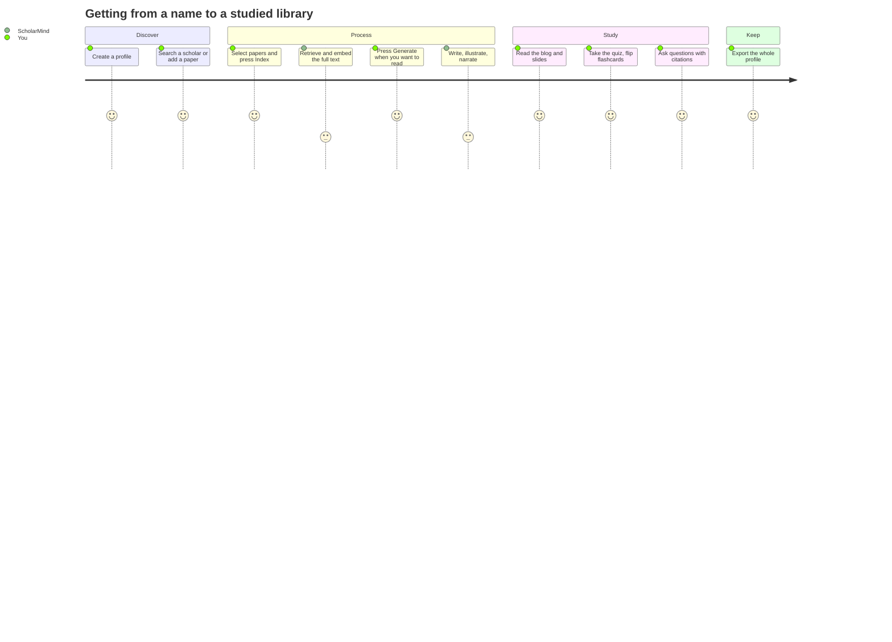
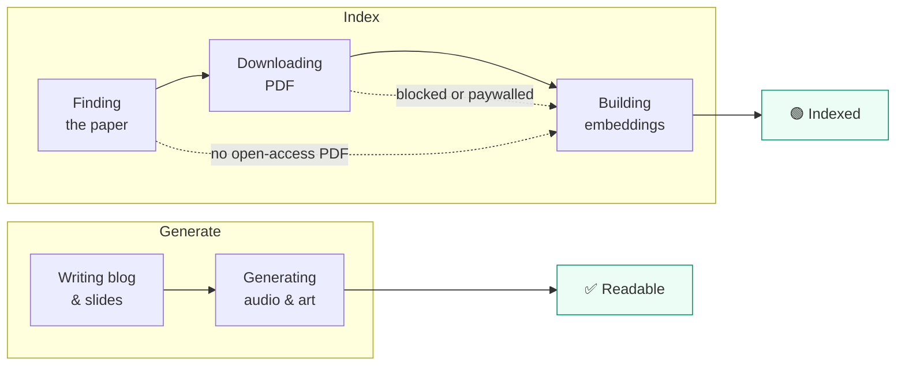
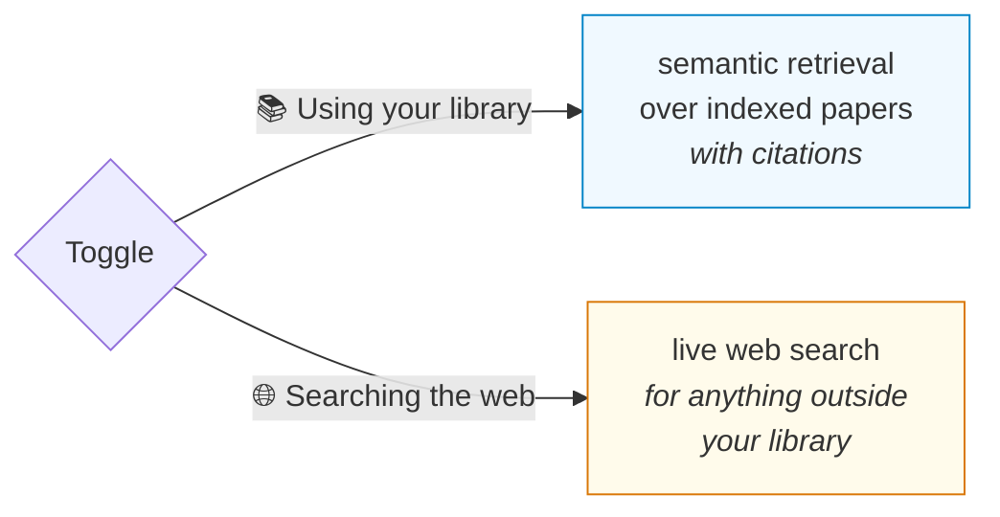

# Features & User Guide



---

## 1. Profiles

Each profile is an independent library — its own papers, chat history, theme, and search index. Create one per scholar or topic. Everything is stored server-side, so a profile follows you across browsers and devices.

## 2. The landing page

The app opens on a question, not a file list.

**Find a library** searches what you already have — by scholar, Google Scholar
link, title or topic. It is answered from stored identities with no model call,
so arriving with someone in mind lands in their library immediately. Nothing
found offers to build it.

**Ask everything** puts a question to every library at once. The answer says
which libraries it searched — and, if you have more than five, how many it could
not. That limit is the API's, not a choice: File Search accepts at most five
stores in one call.

Open a library and the same question is scoped to that library alone.

## 3. Adding things

| Tab | Takes |
| :--- | :--- |
| **Search Scholar** | A name, or a Google Scholar profile URL |
| **Add Paper** | A paper title |
| **Add Source** | Any link, or an uploaded file |

**Search Scholar** returns the scholar's affiliation, topics and most-cited
papers, and names the profile after them. If you already have a library for that
scholar it says so and offers to open it, rather than quietly building a second
one — including across name variants, so "G. E. Hinton" finds your "Geoffrey
Hinton" library.

**Add Source** takes anything:

| Paste | And it |
| :--- | :--- |
| A YouTube link | Watches the video |
| A Wikipedia article | Reads the page |
| Any web page | Reads the page |
| A PDF link | Fetches and reads it |

Or upload a file — PDF, text, audio or video, up to 50MB. Recordings are
transcribed; videos are watched.

Each source is read **once**, when added. Indexing and generation both work from
what was extracted, so a two-hour video is never watched twice.

## 4. Processing

Select papers, then choose what you want. The two buttons are independent — run
either, both, or one and then the other later.

| Button | What it does | Roughly | Gives you |
| --- | --- | --- | --- |
| **Index** | Fetches the PDF and embeds it into this profile's search index | 5–10s per paper | Chat that answers from your papers, with citations |
| **Generate** | Writes the blog, slides, quiz, flashcards, audio and cover art | ~1min per paper | Everything under **Read** |



The dotted paths matter: when a PDF cannot be retrieved, the paper is still
indexed — from its abstract, and from the write-up if you have generated one.
Those papers carry an **Indexed (summary)** badge instead of **Indexed**, so you
always know which answers rest on full text.

Indexing first is usually the better order: **Generate** then grounds its writing
in the indexed full text rather than in a web search.

**One library per scholar.** Searching for a scholar you already have a library
for offers to open the existing one instead of building a second — which would
mean a second index and a split chat history. You can still choose to build a
separate library. It recognises the same scholar across a profile URL, a typed
name, and abbreviated forms like "G. E. Hinton".

**Papers are only fetched once.** If any profile has already indexed a paper,
the next one to index it reuses the downloaded PDF instead of hunting for it
again — roughly twice as fast, and it still works when the publisher has since
started blocking automated access. Each profile keeps its own search index, so
no profile can ever retrieve another's library.

The status bar shows how many papers of the batch are done, and what each
in-flight paper is currently doing.

## 5. Reading

**Read** opens the viewer:

- **Blog** — the generated article, with cover art
- **Slides** — the deck
- **Quiz** — multiple choice with explanations
- **Flashcards** — click to flip

**Listen** plays the narrated summary.

**Conversational quiz** — in the Quiz tab, enable conversational mode and an AI host reads questions aloud and responds to your answers. Five voices: Kore, Puck, Charon, Fenrir, Zephyr.

## 6. Chat

The Scholar Bot answers from your library and shows the sources it used — expand **"N sources from your library"** under any answer to see the document and the passage it drew from.

**One grounding mode per message:**



They cannot be combined — the API rejects requests attaching both — so the toggle makes the choice explicit rather than guessing.

You can also type `analyze [paper title]` to find, add, and process a paper from the conversation.

## 7. Citations

Every source has a **Cite** button offering six styles:

| Style | Looks like |
| :--- | :--- |
| BibTeX | `@article{vaswani2017attention, …}` |
| APA | Vaswani, A., Shazeer, N., & Parmar, N. (2017). Attention Is All You Need. |
| MLA | Vaswani, Ashish, et al. "Attention Is All You Need." 2017. |
| Chicago | Vaswani, Ashish, Noam Shazeer, Niki Parmar. "Attention Is All You Need." 2017. |
| Harvard | Vaswani, A., Shazeer, N., & Parmar, N. 2017, 'Attention Is All You Need', … |
| RIS | `TY  - JOUR` … `ER  -` |

Journal, volume, issue, pages and DOI are looked up from Crossref. When no
Crossref record matches, the citation shows only what the library actually knows
and says so — nothing is invented to fill the gaps, because a made-up volume
number reads as authoritative and ends up in somebody's bibliography.

Non-paper sources are cited as what they are: videos carry `[Video]`, web pages
carry an accessed date.

The whole library exports as one bibliography in any style.

## 8. Export

The download icon on a profile card produces a ZIP:

```
profile-name/
  paper-title/
    blog.md          (with YAML front matter)
    slides.md
    quiz.md          (answers marked)
    flashcards.csv
    metadata.json
    illustration.jpg
    audio.wav        (playable, 24kHz mono)
    paper.pdf        (when retrieved)
  README.md          (index of the library)
```

## 9. Themes

Light or dark. The toggle sits in the header of both the landing page and any
library, and defaults to your operating system's setting. It is remembered on
the device, and applied before the page paints — so switching to dark does not
flash white first.
