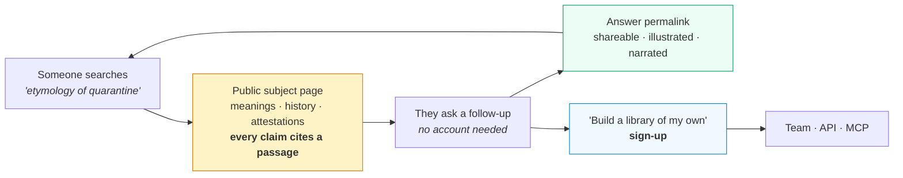

# Roadmap

What is being built next, in what order, and what is deliberately not being
built. The argument for it is in [comparison](../comparison/README.md); the
file-by-file implementation steps are in
[`.claude/plans/subjects-and-adoption.md`](../../.claude/plans/subjects-and-adoption.md).

**"Good" means three specific things,** and every item below is scored against
them:

1. A stranger can experience it in under a minute.
2. Its answers are measurably right.
3. It does something the free alternative cannot.

---

## The one idea

Two goals — *make people use it* and *let any subject be a library* — are the
same goal.

A scholar library appeals only to someone who already has a scholar in mind. A
**word** has millions of people a day who already want it, and every one of
those queries is answerable from public-domain sources with a citation.

The mechanism that makes this work is already built. A dictionary on top of a
model invents etymologies; this one **structurally cannot**, because no
retrieved passage means no model call. That is checkable on a public page — so
the free surface builds trust rather than spending it.

---

## Priority

### Tier 0 — Without these, nothing else counts

| # | Gap | Today | Who beats us | Build | Effort |
| :-- | :-- | :-- | :-- | :-- | :-- |
| 1 | Semantic retrieval | Keyword-only; `0004` unapplied | Everyone | Measure `EMBEDDING_DIM`, migrate, reindex | **S** |
| 2 | Measured quality | Zero published numbers | PaperQA2 | Eval set + `scripts/eval.mjs` → correct / abstained / wrong | **M** |
| 3 | Anonymous access | Sign-in required to see anything | NotebookLM, every site | `public` visibility branch, `/public/:slug` | **M** |
| 4 | Cost containment | Uncapped | — | `answers` cache, IP limits, daily uncached cap | **S** |
| 5 | Empty state | A new user sees nothing | Everyone | Seed 1,000 words · 250 books · 100 scholars | **M** |

### Tier 1 — Needed to be *chosen* over the alternative

| # | Gap | Today | Who beats us | Build | Effort |
| :-- | :-- | :-- | :-- | :-- | :-- |
| 6 | Any subject is a library | Scholars only | Nobody does this | `subject_kind` · `subject_key` · `facets` | **M** |
| 7 | Book & word sources | None | Dictionary sites — ungrounded | Gutenberg, Open Library, Wiktionary, Wikidata, Ngrams, Chronicling America | **L** |
| 8 | Composed subject page | A chat box | Wiktionary, Etymonline | Senses, etymology chain, timeline, frequency, "heard in the wild" | **M** |
| 9 | Shareable answers | None | Everyone | Permalinks + OG images | **S** |
| 10 | Narrated, illustrated answers | Per-paper only | NotebookLM audio overviews | Wire existing TTS and image paths into answers, cached | **S** |
| 11 | Reference import | Export only | PaperQA2 reads Zotero | Zotero / BibTeX / RIS import | **S** |
| 12 | Thin-library signal | `deepCount`, buried | — | Surface abstention rate as *"this library is thin"* | **S** |

### Tier 2 — Leverage, once 0 and 1 hold

| # | Gap | Audience | Build | Effort |
| :-- | :-- | :-- | :-- | :-- |
| 13 | No reason to return | Learners | Word / book of the day, digest — on the existing crawler schedule | **S** |
| 14 | No classroom path | Teachers | Course mode, class links, no student accounts | **M** |
| 15 | No distribution | All | MCP directory listing, embed widget, sitemap and structured data | **M** |
| 16 | Voice in | All | Record in-browser → existing transcription path | **S** |
| 17 | Vendor lock-in | Cost, risk | Model-agnostic `plainModel()` path, validated by #2 | **M** |
| 18 | No revenue mechanics | Teams | Seats, usage view, key management UI | **M** |

### Tier 3 — Explicitly not building

| Gap | Verdict |
| :-- | :-- |
| Live voice conversation | Gated on a spike; **does not ship if abstention cannot hold in a live session** |
| Paywalled corpus | Impossible — cede to Elicit and Scopus AI |
| Connectors, SSO, enterprise search | Cede to Onyx |
| Citation graph | Cede to ResearchRabbit and Connected Papers |
| Systematic-review tooling | Cede to Elicit |
| User-published shelves | Blocked until a moderation path exists |
| Video out, mobile app | After the web loop works |

> **If only five things get built:** 1, 4, 3, 5, 2 — in that order. That gets a
> stranger to a working, checkable answer in under a minute, with a bill that
> can be predicted and a number that can be defended.
>
> **Tier 1 is what makes it worth returning to.** Items 6–8 are the only rows on
> this page that nobody else has.

---

## The decisions behind it

**A profile becomes a subject by gaining a kind, not a table.** `profiles` gains
`subject_kind` (`scholar | book | word | topic | collection`), `subject_key` and
`facets`. A new table would need ACLs, sharing, the crawler, the queue, corpus
de-duplication, the index, export and chat rebuilt around it; a column inherits
all of them on the day it is added. The test of whether the abstraction is right
is that `search.ts`, `indexer.ts`, `advisor.ts` and `authz.ts` show **no diff**.

**Only public-domain and open-access sources — and here that is an advantage.**
Project Gutenberg, Open Library, Wikisource, Wiktionary, Wikidata, Google Books
Ngrams, Chronicling America. Not Etymonline, not the OED, nothing in copyright.
Against Elicit this constraint is a permanent weakness; against a *dictionary* it
inverts, because the corpus of word history and classic literature **is** public
domain.

**Public reading needs no account, and public answers are cached.** Every
question on a public subject is normalised and stored with its citations, so a
repeat costs no model call. Three consequences, all load-bearing: cost is bounded
by distinct questions rather than traffic, the cache *is* the indexable surface,
and it is the corpus the evaluation samples. The ACL predicate is not bypassed —
`visibilityPredicate` gains a `public` branch and stays the single decision.

**A word page is composed, not a chat log.** A stranger who typed one word is
badly served by an empty input. Each block is grounded, and each is already
producible:

| Block | Grounded in | Built with |
| :-- | :-- | :-- |
| Senses, by currency | Wiktionary sense list | Structuring pass, no tools |
| Etymology chain | Wiktionary + Wikidata | Structured data → diagram |
| Timeline of first uses | Chronicling America, Gutenberg | Retrieval; the passage is shown |
| Frequency over 200 years | Ngrams | Static chart, no model |
| Heard in the wild | Indexed books | Pure retrieval, zero generation |
| Illustration, read-aloud | — | Existing image and TTS paths |
| Ask anything | The above, indexed | `askAdvisor`, abstention included |

**Voice ships in three stages, and only the first is unconditional.** Narrated
answers reuse the TTS path that exists. Voice-in reuses the transcription path
that exists. Live conversation is gated on a spike — if retrieval cannot be
injected per turn and citations cannot survive, it does not ship, because a
fluent voice inventing an etymology destroys the one property that makes this
trustworthy.

**Evaluation ships before the audience.** Three numbers — grounded-correct,
abstained, wrong. Only *wrong* is a failure; a high abstention rate is a thin
library, which is a build problem and must be visible as one.

---

## How progress is measured

Chosen so they cannot be satisfied by traffic alone.

| Metric | Why this one |
| :-- | :-- |
| Time to first grounded answer, anonymous | Target under 10 seconds. Today it is effectively infinite |
| Wrong-answer rate | The only number that can kill the product. Abstentions are not failures |
| Abstention rate on public pages | High means libraries are thin — a build problem, not a model problem |
| Cache hit rate on public questions | Determines whether the cost model survives success |
| Share rate per answer | Whether the growth loop is a loop or a funnel |
| Public page → account conversion | Whether the free surface feeds the product or replaces it |
| Week-4 retention | Whether anyone builds a *second* library |

---

## Known risks

| Risk | Mitigation |
| :-- | :-- |
| Cost spikes with traffic | The answer cache, a global daily cap on uncached questions, per-IP limits. Modelled before launch, not after |
| Public pages read as thin AI content | Every block is retrieved text or structured data from a named source. The pages are mostly quotation — which is what a dictionary should be |
| A wrong etymology goes viral | Structural abstention, feedback triage, published eval numbers. One viral wrong answer costs more than a month of traffic is worth |
| Licence obligations | Wiktionary is CC-BY-SA: attribution and share-alike are obligations, and a generated summary is a derivative work. Handled in the source adapters or not at all |
| Gemini lock-in | Public traffic makes this a cost dependency. Tool-free calls already read `plainModel()`; the evaluation turns swapping it into a measurable decision |
| Four audiences at once | Tiers 0 and 1 serve all four identically. Only Tier 2 forks, and each wedge is independently droppable |
| The name | *ScholarMind* stops fitting the moment a word is a library. A decision is needed before public URLs exist, since they are hard to change afterwards. This is a product decision, not an engineering one |

## Open questions

1. Does a composed page beat a chat box for a first-time visitor? Assumed yes;
   cheap to test with two public pages.
2. How thin is a word library really? Measure on 20 seeded words before
   committing to 1,000.
3. Naming and domain — see above.
4. Does live voice hold abstention? Answered by a spike, not by discussion.
5. Is there a paid consumer tier, or is the public surface purely a funnel to
   teams? Affects nothing before Tier 2.
