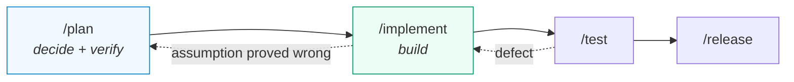
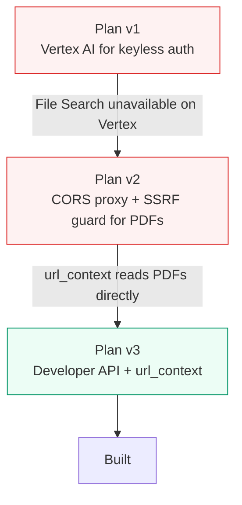
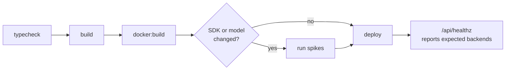

# SDLC

Four phases, each backed by a Claude Code skill. Plans live in `.claude/plans/` and persist across sessions.

---

## Plan

Produces a numbered plan at `.claude/plans/<feature>.md` before any code exists: files to change, contract changes, tests to write, docs to update — and above all **the decisions and their trade-offs**.

**Verify assumptions here, not during implementation.** This rebuild was planned three times because research invalidated it twice:

The first cost a rewrite of the auth story. The second **deleted an entire component** — the proxy, its host allowlist, and its SSRF guard were never needed. Both were caught by reading current API documentation instead of relying on recall.

### Spike before committing to a design

Where a plan rests on unverified API behaviour, write a script that proves or disproves it. `scripts/spike-phase0*.mjs` retired one risk outright (the SDK major bump turned out to be non-breaking) and corrected three assumptions before any dependent code existed.

Cheap to run, and far cheaper than discovering it mid-implementation.

## Implement

Work the plan in order, confirm each step compiles, tick it off in the plan file so progress survives a session ending.

If the plan is wrong, say so rather than improvising around it, and record the deviation. This project accumulated several worth knowing later — for example adding `google-auth-library`, because "verify the IAP header" is not the same as trusting it.

**Some things are only knowable from a live run.** Two-stage generation exists because single-call generation failed against the real API in a way no amount of planning would have predicted.

## Test

Not yet configured. The plan specifies Vitest, scoped to logic that is pure or easily faked rather than the React tree:

| Target | Why |
| :--- | :--- |
| `pcmToWav` | assert the exact 44 header bytes |
| `blobStore` | one contract suite across both implementations |
| `repository` | CRUD and cascade deletes against the emulator |
| `paperSource` | resolution fallback order, mocked `fetch` |
| `identity` | including rejection of a forged assertion |
| `export.slugify` | traversal, collisions, unicode |

Until then `npm run typecheck` and the spikes are the safety net.

## Release

Deployment is `gcloud builds submit --config cloudbuild.yaml`. See [deployment](../deployment/README.md).

---

## Write it down

Findings that cost real time belong in the docs, not just a commit message. The two grounding constraints in [architecture](../architecture/README.md#grounding-two-hard-constraints) each took a debugging session; both are now a paragraph that saves the next person that session.
